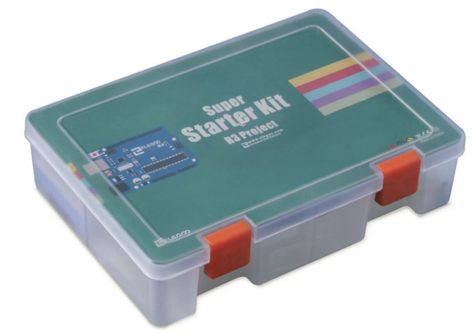
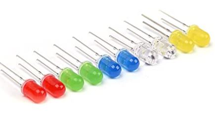
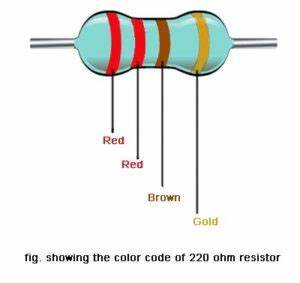
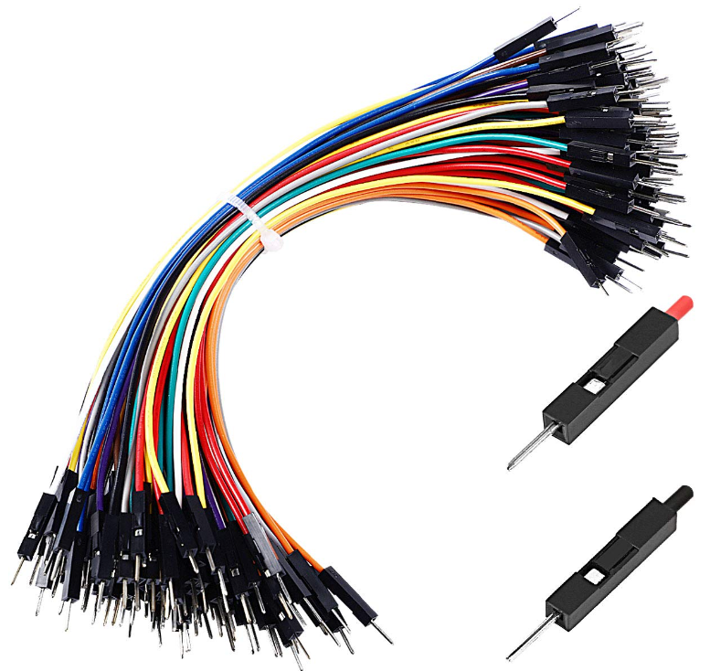
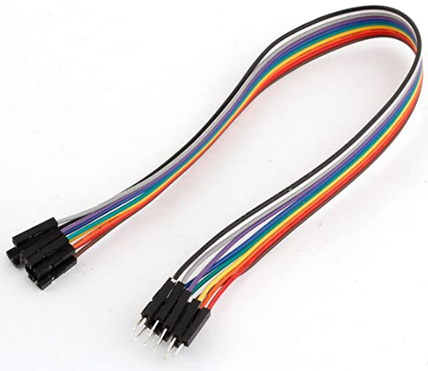

## Introdução - Construindo com Arduino

Eletrônicos como microcontroladores, sensores e todos os tipos de circuitos estão ao nosso redor! Alguns são muito básicos e fornecem informações de telemetria para sistemas de tráfego. Outros executam os semáforos programados com temporização embutida.

Hoje trabalharemos em algumas atividades para mostrar algumas das capacidades desta plataforma. Começaremos pequenos e simples e construiremos para maiores e mais complexos. Você aprenderá todas as informações básicas sobre como usar a placa controladora Arduino, sensores e componentes. Depois de fazer cada atividade, sinta-se à vontade para mudar algumas coisas para ver o que é diferente e obter uma compreensão mais profunda

## Os Componentes

 Os componentes que usaremos para o projeto são mostrados abaixo. Certifique-se de ter todos esses componentes antes de começar:

`Elegoo` O Kit Super Iniciante de Projeto UNO com Tutorial para Arduino inclui todo o hardware (com exceção do computador)

* Componentes principais necessários para todas as atividades
  * Arduino UNO R3
  * Cabo USB A para B
  * PC com Windows 10
  * Software Arduino IDE (baixar)

* Componentes adicionais necessários para atividades específicas
  * (5) LEDs (any color)

  * (5) [220ohm resistor](https://somanytech.com/220-ohm-resistor-color-code)

  * Fios de jumper

  * Fio de jumper fêmea para macho

  * Painel LCD + resistor 5K ohm
  * Bateria 9V (opcional)

## Tabela de conteúdos

Tabela de conteúdos

{}

