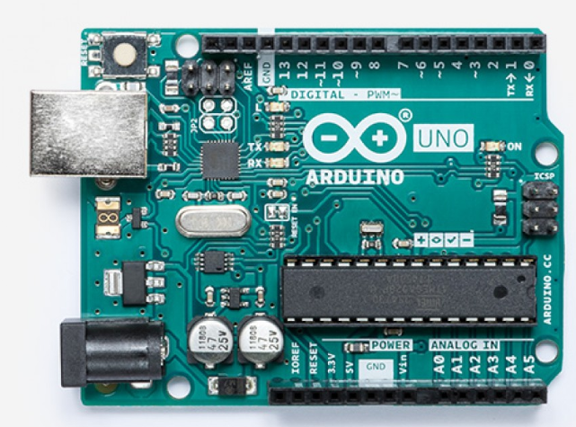

Título: "Arduino: Jogo de luzes"
Descrição: "Construa um microcontrolador Arduino"
Data: 2020-07-27T14:04:59.61-07:00
Dificuldade: "Intermediário"
Ícone: "fas fa-microchip"
Rascunho: falso
---

## Introdução - Construindo com Arduino

Eletrônicos como microcontroladores, sensores e todos os tipos de circuitos estão ao nosso redor! Alguns são muito básicos e fornecem informações de telemetria para sistemas de tráfego. Outros executam os semáforos programados com temporização incorporada.

Hoje trabalharemos em algumas atividades para mostrar algumas das capacidades desta plataforma. Começaremos pequenos e simples e construiremos para maiores e mais complexos. Você aprenderá todas as informações básicas sobre como usar a placa controladora Arduino, sensores e componentes. Depois de fazer cada atividade, sinta-se à vontade para mudar algumas coisas para ver o que é diferente e obter uma compreensão mais profunda.

## Os Componentes

Os componentes que usaremos para o projeto são mostrados abaixo. Certifique-se de ter todos esses componentes antes de começar:

O kit super iniciante do projeto `Elegoo` UNO com tutorial para Arduino inclui todo o hardware (com exceção do computador)

* Componentes principais necessários para todas as atividades
  * Arduino UNO R3
  * Cabo USB A para B
  * PC com Windows 10
  * Software Arduino IDE (download)

* Componentes adicionais necessários para atividades específicas
  * (5) LEDs (qualquer cor)

  * (5) [Resistor 220ohm](https://somanytech.com/220-ohm-resistor-color-code)

  * Fios jumper

  * Fio jumper fêmea para macho

  * Painel LCD + resistor de 5K ohm
  * Bateria de 9V (opcional)

## Tabela de Conteúdo

Tabela de Conteúdo

{}

; não traduza a chave do cabeçalho title; não traduza o html da imagem