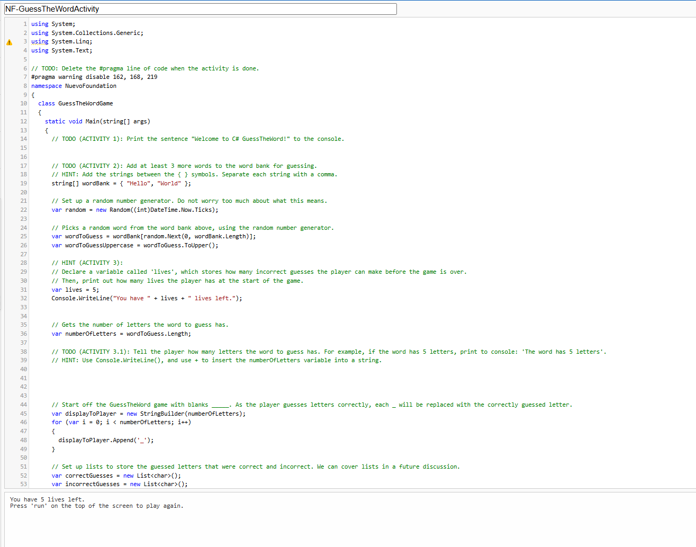
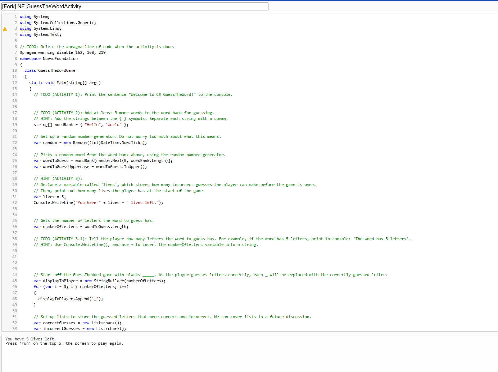

## Bem-vindo

O objetivo da atividade de hoje é aprender habilidades de C# e usar o seu novo conhecimento para criar um jogo de Adivinhe a Palavra!

## Começando

O objetivo da atividade de hoje é aprender habilidades de C# e usar o seu novo conhecimento para criar um jogo de Adivinhe a Palavra! Vamos preparar o jogo.

Hoje você usará o .NET Fiddle, que é uma ferramenta online feita para te ajudar a aprender, construir e rodar código em C#.

{}
Antes de começar, você pode se cadastrar em uma conta do .NET Fiddle, se ainda não tiver uma, e quiser salvar seu trabalho depois.

Clique no botão abaixo para criar uma conta no .NET Fiddle – você vai precisar de um e-mail para isso. Se já tiver uma conta no .NET Fiddle, pode fazer login com o botão abaixo também.

<a class="my-2 mx-4 btn btn-info" href="https://dotnetfiddle.net/SignUp" target="_blank">Cadastre-se no .NET Fiddle</a>

{}

Em seguida, abra o console do .NET Fiddle que vamos usar hoje clicando no botão abaixo. Você verá a tela mostrada abaixo.

<a class="my-2 mx-4 btn btn-info" href="https://dotnetfiddle.net/lMl7j4" target="_blank">Abrir o .Net Fiddle</a>

{}
Se você fez login, pode criar um "fork" do Fiddle, que significa fazer uma cópia do programa, para que possamos fazer nossas próprias mudanças e salvá-lo. Clique no botão "Fork" no topo.

Depois de criar o fork, você verá uma janela parecida com a mostrada abaixo:

{}

Vamos ignorar alguns detalhes desta tela, mas veremos alguns conceitos básicos que aparecem. O arquivo `main.cs` contém código, ou instruções para o computador executar. Ao apertar o **run**, você diz ao computador para realizar as instruções do código. Qualquer resultado da execução será mostrado no lado direito, chamado de **console**.

Se você apertar **run** agora, verá que nada acontece! Sua missão é ajudar a Nuvi a completar o código para este jogo!

Qualquer atividade na seção **Activity** será feita nesta aba do navegador. Você fará essas atividades sozinho, mas a ajuda está disponível se precisar.

## Índice

Índice

{}

