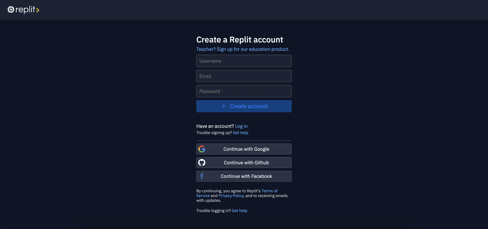

## Bem-Vindo

O objetivo da atividade de hoje é aprender habilidades em C# e incorporar seus conhecimentos recém-descobertos para criar um jogo Guess The Word!

## Começando

O objetivo da atividade de hoje é aprender habilidades em C# e incorporar seus conhecimentos recém-descobertos para criar um jogo Guess The Word! Vamos preparar o jogo.

Hoje você estará usando Replit. Antes de começar, você precisará se inscrever para uma conta Replit, se você ainda não tiver uma. 

Clique no botão abaixo para se inscrever para uma conta Replit - você precisará de uma conta de e-mail para se inscrever. Se você já tem uma conta Replit, você pode entrar em sua conta usando o botão abaixo também.

<a class="my-2 mx-4 btn btn-info" href="https://replit.com/signup" target="_blank">Inscreva-se no Replit</a>

Em seguida, inicie o console Replit que usaremos hoje, clicando no botão abaixo. Você deve ver a tela abaixo.

<a class="my-2 mx-4 btn btn-info" href="https://replit.com/@nuevofoundation/NF-GuessTheWordActivity" target="_blank">Executar Replit</a>

Vamos agora bifurcar o Repl, o que significa simplesmente fazer uma cópia do programa, para que possamos fazer nossas próprias alterações nele. Clique no botão "Fork Repl" no canto superior direito e, em seguida, no botão "Fork Repl".

Depois de forjar o Replit, você verá uma janela semelhante à abaixo:

Vamos ignorar alguns dos detalhes nesta tela, mas vamos passar por alguns dos conceitos básicos que aparecem. O ficheiro `main.cs` contém código ou instruções para o computador executar. Ao pressionar o botão **run**, você diz ao computador para executar as instruções no código. Qualquer resultado da execução do código será exibido no lado direito, chamado de **console**.

Se você pressionar **run** agora, verá que nada acontece! Seu trabalho é ajudar Nuvi completar o código para este jogo!

Quaisquer atividades nas seções **Atividade** serão feitas nesta guia do navegador. Você fará essas atividades por conta própria, mas a ajuda está disponível quando você estiver preso.

## Índice

Índice

{}

