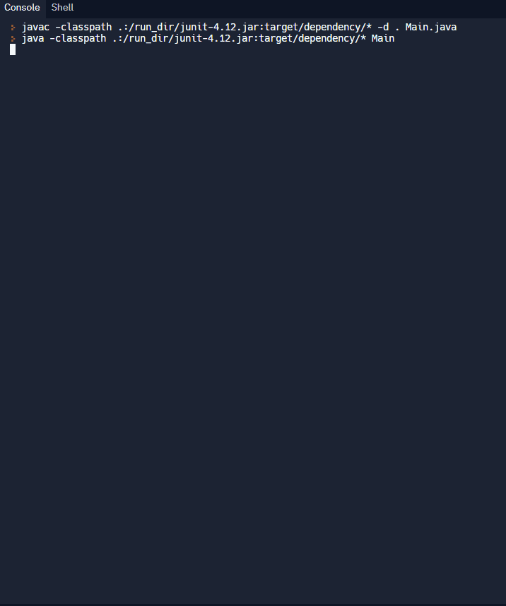

{}
#### Pré-requisitos (do módulo Java: Conceitos Básicos)

- atividade-1: <a href="../../java-basics/activity-1" target="_blank">Mensagens no Console e Comentários</a>
- atividade-2: <a href="../../java-basics/activity-2" target="_blank">Variáveis e Tipos</a>
- atividade-3: <a href="../../java-basics/activity-3" target="_blank">Operadores</a>
- atividade-5: <a href="../../java-basics/activity-5" target="_blank">Métodos</a>
- atividade-6: <a href="../../java-basics/activity-6" target="_blank">Objetos e Classes</a>
- atividade-7: <a href="../../java-basics/activity-7" target="_blank">Estruturas de Dados (Array e ArrayList)</a>

Esses são os conceitos do módulo `Java: Conceitos Básicos` que vamos usar nesta atividade. Se precisar, volte nessas atividades para revisar ou aprender os conceitos antes de continuar!
{}

## Visão Geral

Neste workshop, você vai aprender a criar um programa de **Jogo da Velha** em Java do zero até a versão final! 🕹️

Você vai precisar de conhecimento básico de Java do módulo [Java: Conceitos Básicos](../java-basics), pois vamos assumir que você já sabe sobre variáveis, operadores, classes e arrays durante os exercícios.

Também haverá links para os tópicos relevantes de Java em cada página, caso você queira revisar um conceito específico!

(imagem criada por ParkerPup: giphy.com/parkerpup)

## Índice

Índice

{}

## Demonstração

O gif a seguir mostra o programa que você vai criar até o final do workshop! Dá uma olhada! 👀

<iframe height="600px" width="100%" 
 src="https://replit.com/@nuevofoundation/JavaTicTacToeDemo?lite=true&outputonly=1" scrolling="no" frameborder="no" allowtransparency="true" allowfullscreen="true" sandbox="allow-forms allow-pointer-lock allow-popups allow-same-origin allow-scripts allow-modals"></iframe>
