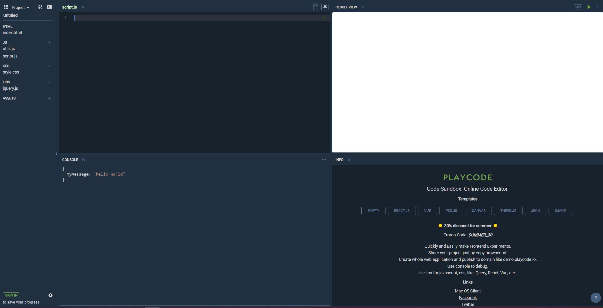

## Índice

Índice

{}

## Noções Básicas de JavaScript
Olá! Se você está lendo isso, espero que signifique que você está aqui para aprender JavaScript 😁🥳. Seja sua primeira vez programando ou se você está querendo aprender rapidamente uma nova linguagem, você está no lugar certo! Prepare-se para descobrir o poder da programação e se divertir. 

## O que é código?

Não podemos aprender a programar sem antes entender exatamente o que é código. Pense no seu site favorito, se não conseguir pensar em um, vamos usar o exemplo do site NuevoFoundation.org. Como usuário, tudo o que você precisa fazer é digitar o endereço do site no seu navegador e, antes que perceba - ta da! - o site aparece, com todas as suas cores bonitas e imagens do nuvi.

Fácil, certo? Não exatamente. Por trás do que parece ser uma interação simples, existem centenas - senão milhares! - de linhas de código para fazer tudo funcionar. Vamos observar apenas uma etapa dessa interação: pesquisar e acessar o site da Nuevo Foundation. Existem bilhões de sites (1,7 bilhão da última vez que verifiquei), como o seu navegador acessa o site que você deseja tão rapidamente? Pense nisso por um segundo...

Existem pessoas que codificaram isso, pessoas que codificaram o seu navegador, o site Nuvi e até mesmo este conteúdo que você está lendo, e... bem, você entendeu. Código é a forma como nós, seres humanos, projetamos e construímos coisas como sites, aplicativos e jogos. É a linguagem que usamos para dizer aos computadores o que fazer.

## O que é JavaScript e para que ele é usado?

Assim como existem várias línguas humanas, também existem várias linguagens de programação. Talvez você já tenha ouvido falar de algumas delas, como Python ou Java. Cada linguagem de programação tem suas forças e finalidades — por exemplo, CSS é usado para estilizar sites, Python é muito bom para ciência de dados, e assim por diante.

O JavaScript é frequentemente chamado de "a linguagem da web". Praticamente qualquer site que você possa imaginar utiliza JavaScript de alguma forma. O JavaScript é muito bom para controlar o comportamento de um site, por exemplo, controlar o que acontece quando você clica em um botão ou transferir dados entre páginas.

A boa notícia é que, uma vez que você aprende uma linguagem de programação, você pode aprender outra rapidamente, pois os fundamentos tendem a ser semelhantes.

## Configuração do Ambiente

Ambiente? Achei que isso era uma oficina de programação!

Ambiente é apenas como os programadores chamam o local onde configuram as ferramentas para programar. Sabe quando você usa coisas como o Microsoft Word ou Google Docs para escrever redações? Você pode pensar nisso como o seu ambiente de "escrita de redações".

Para os programadores, existem aplicações chamadas IDEs, que significa Ambiente de Desenvolvimento Integrado (do inglês "Integrated Development Environment"). Esses são os tipos de aplicativos que permitem escrever e executar código.

Para esta oficina, usaremos o playcode.io.

Quando você abrir o playcode.io, existem algumas coisas que você precisa fazer antes de começarmos:
* Feche todos os arquivos no canto superior esquerdo, exceto o __script.js__.
* Exclua tudo que está no arquivo __script.js__.
* Desative o modo __live__ clicando uma vez no botão __live__ no canto superior direito.

Se você fez todas as etapas acima corretamente, sua tela deve se parecer com esta:

Agora estamos _finalmente_ prontos para começar a aprender JavaScript!