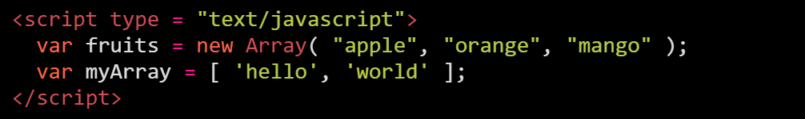

## O que é um Array (Vetor)?

Um array é simplesmente uma coleção de valores. É uma variável especial, que pode conter mais de um valor por vez.

Por exemplo, considere um array chamado frutas, que conteria valores como maçã, laranja, manga etc... todos juntos em uma única variável. 

## Como criar um

As instruções a seguir mostram como criar arrays de duas maneiras diferentes, mas o resultado final é o mesmo.

<b>Syntax:</b>
```javascript
var arrayName = new Array(element0, element1, ..., elementN);
var arrayName = Array(element0, element1, ..., elementN);
var arrayName = [element0, element1, ..., elementN];
```

<b>Example:</b>
