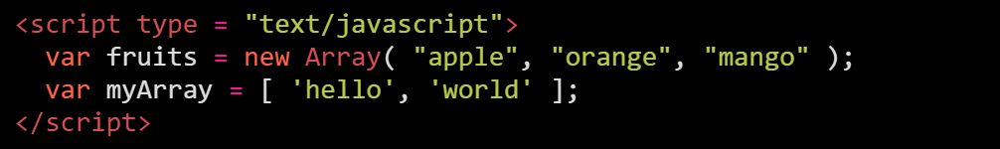

## O que é um Array?

Um array é simplesmente uma coleção de valores. É uma variável especial que pode conter mais de um valor ao mesmo tempo.

Por exemplo, considere um array chamado frutas, que pode conter valores como maçã, laranja, manga, etc... tudo junto em uma única variável.   

## Como criar um

As instruções a seguir mostram como criar arrays de duas maneiras diferentes, mas o resultado final é o mesmo.

<b>Sintaxe:</b>
```javascript
var arrayName = new Array(element0, element1, ..., elementN);
var arrayName = Array(element0, element1, ..., elementN);
var arrayName = [element0, element1, ..., elementN];
```

<b>Exemplo:</b>
