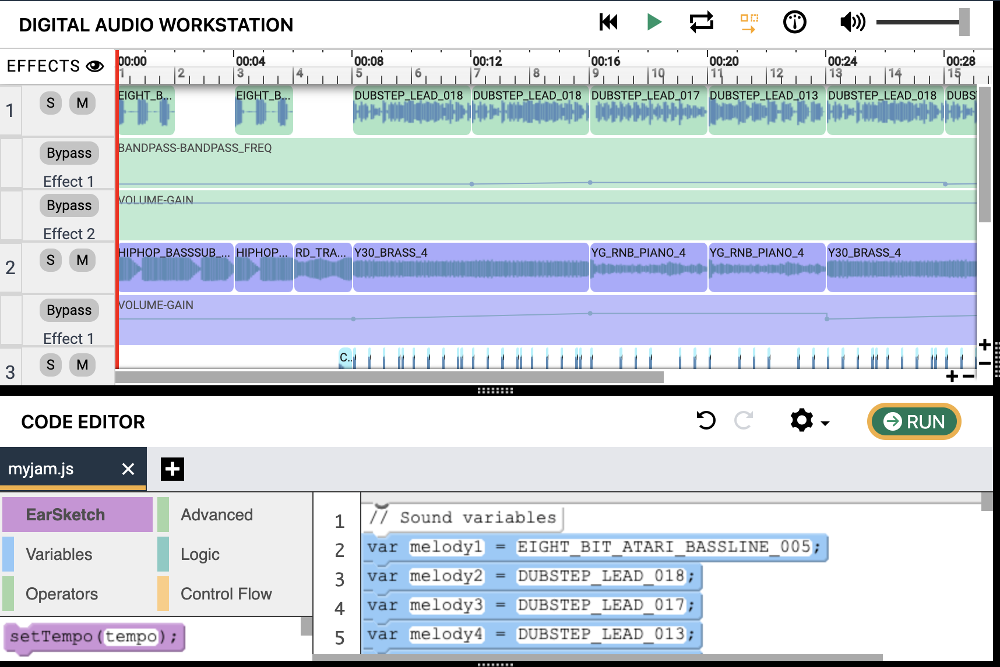

### Vamos fazer música!

Bem-vindo a este guia introdutório sobre como criar música usando [EarSketch](https://en.wikipedia.org/wiki/EarSketch).

### Conheça o DJ Nuvi

### Nuvi tem novos fones de ouvido! Você consegue encontrar os seus?

Você foi convidado para produzir o próximo grande sucesso do Nuvi, mas ao chegar no estúdio, Nuvi revela que o novo projeto será criado com código. Isso nunca foi feito antes; você está pronto para esse desafio? Olhe ao seu redor para encontrar seus fones de ouvido e prepare-se para embarcar nessa com ele!

Antes de começarmos, certifique-se de que seus fones de ouvido estão funcionando. Tente reproduzir o áudio a seguir. O que você ouve?!

<figure>
    <audio
        controls
        src="./audio/good-enough.mp3">
            Test audio to see if your browser supports the audio element. If you cannot play the audio, it likely means your browser does not support this. 
            <code>audio</code> element.
    </audio>
</figure>

## EarSketch overview window

## Table of Contents

Table of Contents

{}

