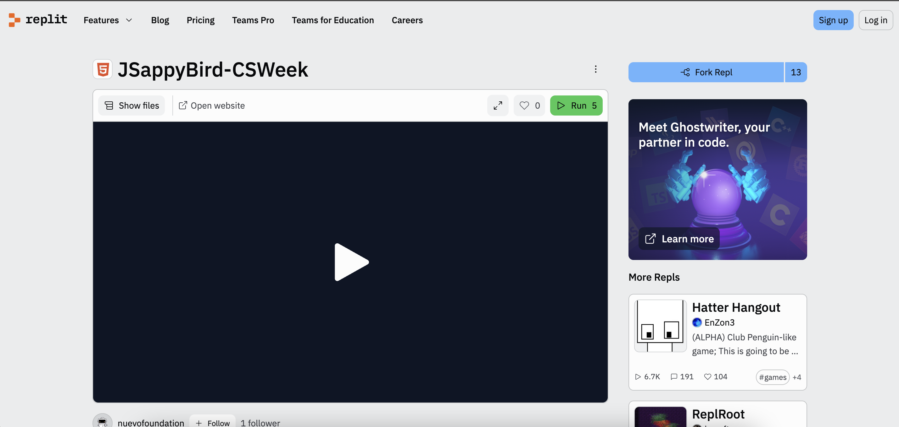
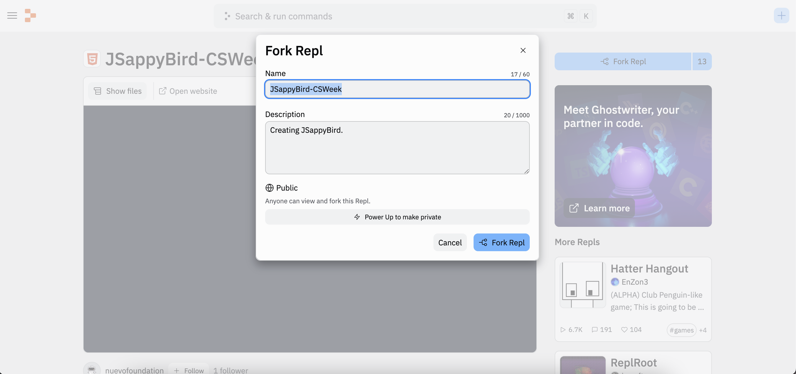
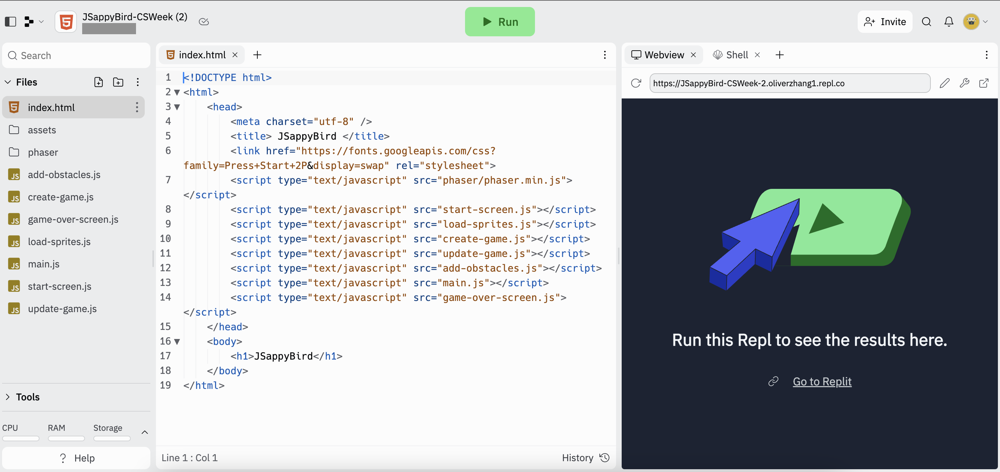

## Introdução

Você já ouviu falar do Flappy Bird, não é mesmo? Neste curso, vamos criar juntos a nossa versão desse joguinho usando algo chamado JavaScript! E aí, preparado para essa aventura divertida?

<iframe src="https://giphy.com/embed/euuaA2cwLEUuI" width="350" height="350" frameBorder="0" class="giphy-embed"></iframe>

Com certeza você já ouviu falar do jogo Flappy Bird, né? Neste curso, vou te ensinar a fazer o seu próprio joguinho! E o melhor: você poderá chamar seus amigos para jogar junto! Juntos, vamos aprender a usar a linguagem de programação chamada JavaScript e fazer o nosso passarinho pular e voar pelo mundo que você vai criar. Vai ser super divertido!.

## Começando

O objetivo de hoje é aprender algumas coisinhas em JavaScript e usar o que aprendemos para criar um jogo estilo Flappy Bird! Vamos preparar o jogo.

Hoje, vamos usar o Replit. Antes de começar, você precisa criar uma conta no Replit, caso ainda não tenha uma. 

Clique no botão abaixo para se registrar no Replit - você precisará de um e-mail para isso. Se você já tem uma conta no Replit, também pode usá-la clicando o botão abaixo para entrar.

<a class="my-2 mx-4 btn btn-info" href="https://replit.com/signup" target="_blank">Criar minha conta no Replit</a>

Em seguida, abra o console do Replit que usaremos hoje clicando no botão abaixo. Você verá a tela que está aí embaixo.

<a class="my-2 mx-4 btn btn-info" href="https://replit.com/@nuevofoundation/JSappyBird-CSWeek" target="_blank">Rode o Replit</a>

Agora, vamos fazer uma cópia desse jogo para que possamos fazer nossas próprias mudanças. Clique no botão "Fork Repl" no canto superior direito e depois no botão "Fork Repl" novamente.

Depois de copiar o Replit, você verá uma janela parecida com a que está logo abaixo:

Vamos ignorar alguns detalhes dessa tela, mas vou te mostrar o básico. O arquivo `index.html` e todos os arquivos terminados em `.js` têm códigos, que são como instruções para o computador. Quando você pressiona o botão executar ou **run**, está pedindo para o computador seguir essas instruções. E aí, qualquer coisa que acontece aparece do lado direito, numa parte que chamamos de **console**.

Se você pressionar executar ou **run** agora, verá que nada acontece! Sua missão é ajudar o **Nuvi** a completar o código deste jogo!

Todas as atividades na secção **Atividade** serão feitas nesta aba do navegador. Você vai fazer essas atividades sozinho, mas se ficar bloqueado ou tiver dúvidas, pode pedir ajuda!

## Conteúdo

Conteúdo

{}

