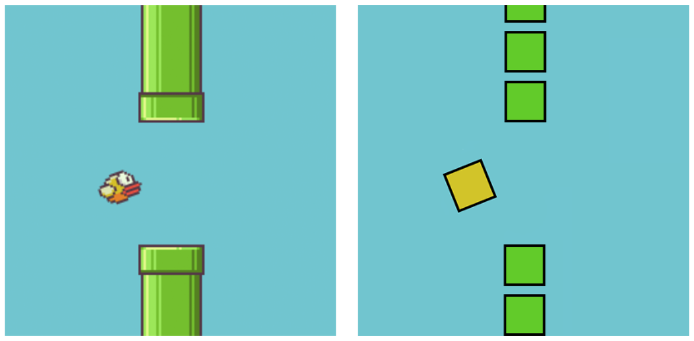

1. **Baixe os arquivos necessários.** <link_here>

O modelo contém os seguintes arquivos:

- phaser.min.js, a estrutura Phaser v2.4.3.
- index.html, onde o jogo será exibido.
- main.js, arquivo onde escreveremos todo o nosso código.
- assets/, um diretório com 2 imagens.
- Activity 1.js
- Activity 2.js
- Activity 3.js

O arquivo index.html é a página principal do nosso jogo flappy bird, que também usa nossos dois arquivos Javascript (`.js`). O arquivo **phaser.min.js** é uma estrutura do jogo que usaremos para criar jogos de navegador. O outro arquivo é **main.js** que conterá toda a nossa lógica Javascript. Os três arquivos de atividades ajudam você a colocar seu jogo em condições de funcionamento. As partes que você precisa adicionar estão marcadas com um 🐤🐤🐤.

Divirta-se!

### Variáveis

Variáveis ​​são simplesmente nomes que podemos dar a valores como strings, números e booleanos. Usamos variáveis ​​para armazenar informações para que o computador possa controlá-las. As variáveis ​​são criadas usando a palavra-chave `var` e o nome da variável. Então você pode atribuir essa variável às informações que deseja armazenar usando um `=` seguido pelas informações.

Por exemplo:

```js
var world = "Hello World";
var x = 88;
var happy = true;
```

Você também pode alterar o valor referenciado por um nome assim:

```js
var x = 4;
x = 10;
```

Neste exemplo, a variável `x` é primeiro atribuída a 4 e depois reatribuída a 10.

O código a seguir irá instanciar um novo objeto do tipo Phaser Game, que será armazenado em uma variável para posterior utilização em nosso jogo.

```js
var game = new Phaser.Game(800, 600);
```

## Atividade 1: Vamos utilizar expressões booleanas e booleana

### Condicionais

Podemos usar declarações if para executar uma instrução de código somente se certas condições forem atendidas.

Por exemplo:

```js
if (isRainingOutside == true) {
  takeUmbrella = true;
}
```

Dentro de `()` ao lado de `if`, você deve especificar uma _expressão booleana_. **Booleans** são declarações `true` ou `false`. Podemos utilizar isso em nossa declaração if. Se a expressão for `true`, o código dentro de `{ }` será executado.

Também podemos usar expressões booleanas para verificar se um número está em um intervalo específico:


Você também pode conectar **expressões booleanas** usando os operadores `&&` (E) e `||` (OU).


`&&` requer que ambas as _expressões booleanas_ sejam `true`, enquanto `||` requer apenas que uma das duas _expressões booleanas_ seja `true`.

Por exemplo:

```js
// produz verdadeiro, pois 5 é tanto menor que 8 e 9 quanto não é igual a 10.

(1 < 100 &&
  (5!= 10)(
    // Retorna verdadeiro, pois 5 é tanto menor que 8 e 9 quanto diferente de 10
    5 == 5
  )) ||
  10 > 20;
```

#### Abra `Activity 1.js` onde você adicionará uma condicional que verifica se o pássaro está entre a parte superior da tela (y = 0) e a parte inferior da tela (y = 490)!

## Atividade 2: Vamos agora adicionar uma função que faz o pássaro pular

### Funções

**Uma função pode ser considerada uma tarefa.** Algumas tarefas são curtas e simples, como adicionar `1 + 1` ou dizer ``Olá Mundo!'`. As funções podem ser usadas para executar as mesmas tarefas várias vezes. Neste caso, escreveremos uma função para fazer o pássaro pular!

“Pular” neste jogo é apenas mudar a _posição_y_ do pássaro.

#### Abra `Activity 2.js` onde adicionaremos uma função chamada `jump`.\*\*

Podemos fazer isso com esta declaração dentro da função `jump`:

```js
bird.body.velocity.y = -300;
```

O número pode ser ajustado dependendo da altura que você deseja que o pássaro salte! Tente alterar o número para ver as diferenças na altura em que o pássaro salta quando você pressiona a barra de espaço.

Agora seu pássaro pode voar pelo ar!

## Atividade 3: Vamos adicionar obstáculos

Atualmente, seu pássaro não tem nada para se esquivar na tela, o que parece um pouco fácil demais! Podemos usar código para aumentar a dificuldade do jogo adicionando objetos para esquivar! Para fazer isso, você precisará usar condicionais e loops (laços) for. Já cobrimos as condicionais, então agora vamos examinar os loops.

### Loops

Loops são usados ​​para executar um bloco de código várias vezes. Existem muitos tipos de loops, mas o que você usará neste projeto é um loop for.

Os loops for são formatados da seguinte forma:

```js
for (declaração 1; declaração 2; declaração 3) {
  // bloco de código a ser executado
}
```

- A declaração 1 é executada uma vez antes de executar o código dentro de `{ }`.
- A declaração 2 é usada para definir a condição na qual o loop irá parar de funcionar.
- A declaração 3 é executada em cada iteração do loop.

Por exemplo

```js
var sum = 0;
for (var i = 0; i < 7; i += 1) {
  sum = sum + 1;
}
```

Depois que esse código for executado, `sum` será 6. Isso ocorre porque o loop adicionou 1 a essa variável 6 vezes.
Você notará que criamos uma variável chamada `i` na primeira instrução do loop for. Esta variável é então usada para rastrear
quanto tempo o loop deve ser executado. Em cada execução do loop, verificamos se `i` ainda é menor que 7 e, se for, executamos o código em
os colchetes e adicione 1 a `i`.

Este processo se repete até que `i <7` seja falso.

Também podemos usar `i` no código entre colchetes:

```js
var sum = 0;
for (var i = 0; i < 7; i += 1) {
  sum = i + 1;
}
```

Este código executa a mesma operação, mas usa `i` entre colchetes.

Você pode observar um loop for em funcionamento neste link: <https://codepen.io/nayomitchell/pen/JgNoQe>! Experimente modificar os valores nas diversas declarações para ver como isso afeta o comportamento do loop.
Você consegue descobrir como fazer o loop fazer uma **contagem regressiva**?

---

Agora de volta ao nosso jogo. A tela pode acomodar 8 blocos, então precisamos de um loop for que seja executado 8 vezes. Na `Atividade 3.js`, você precisará adicionar um loop for ao redor do código que adiciona um obstáculo na tela.

Temos outro problema agora! O jogo é impossível, pois não há como o seu pássaro passar!
Vamos adicionar uma lacuna na parede de obstáculos para o seu pássaro voar!

---

Acima do código que você acabou de editar, há uma variável chamada `hole`. Esta variável é um número entre 1 e 6, que representa onde deve ficar o vão na parede.
O que queremos fazer é pular a criação do obstáculo **`if`** o `i` no loop for **o mesmo** que `hole`. Podemos usar uma condicional para pular a criação de um bloco na parede – deixando uma área para voar!

Atualmente, a parede é feita adicionando um tubo à tela cada vez que o loop é executado. Tente uma condicional em torno de `addOnePipe` no loop que fará com que `addOnePipe` seja executado apenas quando `i` não for o mesmo número que hole.

Agora que você fez essas atividades, você deve ter um jogo funcional! Veja quantos pontos você consegue fazer!
