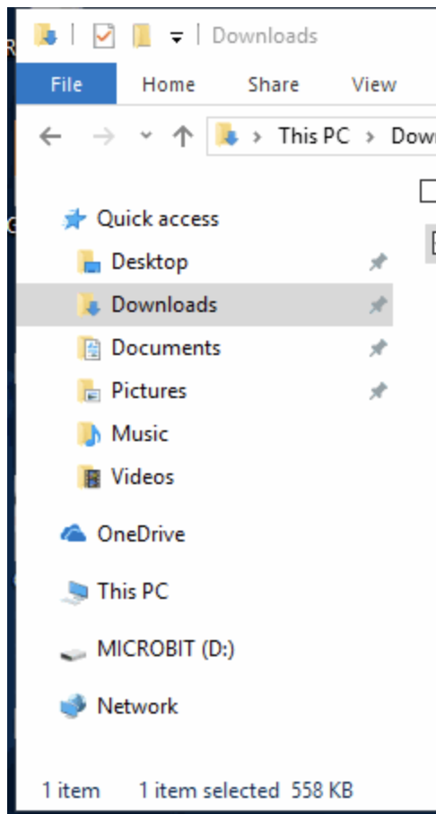

### Uma introdução ao JavaScript e hardware usando [MicroBits](https://microbit.org/guide/)


## O básico

## O que é JavaScript?

JavaScript é uma das muitas linguagens de programação e é conhecida como a linguagem de programação da web. É usado para controlar o comportamento do site, como cliques em botões, janelas pop-up, fluxos de dados e muitas outras funções.

## Variáveis

Variáveis ​​são contêineres em seu código que podem conter um único número, palavra ou outras informações. Essas informações podem ser usadas e alteradas chamando a variável posteriormente em todo o programa. Isso significa que você está solicitando ao seu programa que acesse as informações armazenadas.

Com algumas exceções, as variáveis ​​podem receber qualquer nome que contenha letras, dígitos, sublinhados e cifrões. MAS não importa o que aconteça, não podem ter espaços e devem sempre começar com uma letra.

Variáveis ​​podem conter diferentes tipos de dados, vamos examinar os básicos.

## Os tipos de dados

### Inteiros

Inteiros são quaisquer números que não contenham decimais. Por exemplo, inteiros são números inteiros como `3`, `100`, `6000`, `-3` e assim por diante!

```javascript
// Este é um comentário, usado para descrever o que seu código faz
// Abaixo estão diferentes exemplos de variáveis

// Exemplos de variáveis ​​inteiras (número não decimal):

var a = 5;
var b = 10;
var c = 15;
```

### Doubles

Doubles são números que suportam decimais. Exemplos são números como `0,5`, `1,5` e assim por diante.

```javascript
// Double (número decimal) exemplos de variáveis:

var x = 0.5;
var y = 1.5;
var z = 2.0;
```

### Cordas

Strings são exatamente o que os programadores decidiram chamar de palavras. Se isso ajudar a lembrá-lo de que strings são palavras, pense nelas como uma “sequência” de caracteres. As strings podem ser qualquer coisa como o seu nome ou o nome do seu animal de estimação favorito.

As strings são cercadas por "aspas".

```javascript
// Exemplos de variáveis ​​de string (uma ou mais palavras, também conhecidas como "string" de caracteres):
// os valores das variáveis ​​​​string são colocados entre "aspas"

var company = "My company";
var course = "Coding with Micro:Bits!";
var message = "Coding is so fun!";
```

### Caracteres

Os caracteres são letras únicas. Eles estão cercados por 'aspas simples'.

```javascript
// Exemplo de variável de caractere (uma única letra):
// valores de variáveis ​​de caracteres são cercados por 'aspas simples'

var letter = 'A';
```

### Booleanos

Às vezes, os programadores desejam verificar se certas condições são verdadeiras ou falsas. Essas informações são armazenadas em um tipo de dados booleano.

Se você está curioso para saber por que eles são chamados de booleanos, um cara chamado George Boole foi quem os criou.

```javascript
// Exemplo de variável booleana (verdadeira ou falsa)

var canPigsFly = false;
var codingIsCool = true;
```

## Operações Matemáticas

Ah, sim, nosso favorito, os computadores são essencialmente calculadoras, então deve ser fato que podemos fazer contas com eles. Aqui estão alguns exemplos de matemática que você pode ter em seus programas JavaScript.

### Adição

```javascript
var a = 13;
var b = 10;
var c = a + b;     // c = 25
c += a;            // c = 40
c++;               // c = 41
```

### Subtração

```javascript
var a = 15;
var b = 10;
var c = a - b;     // c = 5
c -= a;            // c = -10
c--;               // c = -11
```

### Multiplicação

```javascript
var a = 2;
var b = 5;
var c = a * b;     // c = 10
c *= a;            // c = 20
```

### Divisão

```javascript
var a = 20;
var b = 2;
var c = a / b;     // c = 10
c /= a;            // c = 5
```

### Módulo

Ah, sim, aquele que parece assustador, mas na verdade não é. As operações de módulo fornecem apenas o resto após a divisão. Por exemplo, `10% 2 = 0` porque quando você divide 10 por 2, não sobra resto.

```javascript
var d = 10 % 2;   // d = 0
var e = 5 % 2;    // e = 1
```

### Declarações Print

Às vezes você deseja que seu computador exiba algum texto ou os dados que suas variáveis ​​contêm. Para fazer isso, usamos declarações `print` (imprimir).

```javascript
console.log("Isso aparecerá no console, mas não na página da web");
alert("Isso será exibido como uma janela pop-up");

var userResponse = prompt("Isso será exibido como uma janela pop-up, com uma caixa de entrada para o usuário digitar");
```

### Operadores Condicionais e Lógicos

Condicionais, mais comumente chamadas de instruções `if`, são usadas para escolher qual código você deseja executar dependendo do valor de suas variáveis ​​ou outras condições.

```javascript
// Condicionais
if (true) {
  // Esta seção do código será executada
}
if (false) {
  // Esta seção do código não será executada
}

var age = 10;
if (age < 18) {
  // Se a idade for igual a 10
  print("Você ainda não é adulto! :( ");
}
```

### Loops

E por último mas não menos importante, temos coisas chamadas loops (laços). Isso permite que você repita partes do seu código até que uma determinada condição seja atendida.

A função `alert()` que você vê usada nos trechos de código abaixo simplesmente exibe um pop-up exibindo o parâmetro que você passa para ela, o parâmetro é o que está dentro dos parênteses, neste caso está exibindo o valor de contagem atualizado.

```javascript
// while loop - contagem regressiva a partir de 10
var count = 10;

while (count > 0) {
  alert(count);
  count--;
}

// for loop - contagem regressiva a partir de 10
for (var i = 10; i > 0; i--) {
  alert(i);
}

// Loop while infinito
while (true) {
  // Isso acontecerá repetidamente para sempre, pois a condição nunca será falsa. verdade é sempre verdade.
}

// quebrar; // interrompe um loop imediatamente e move para a linha abaixo do loop
```

## Introdução ao Micro:Bits

Agora que você conhece o básico do JavaScript, pode usar suas habilidades para começar a programar seus Micro:Bits!

### O que é um Micro:Bit?

Um Micro:Bit é um minicomputador programável! Ele pode ser codificado a partir de qualquer navegador da web em várias linguagens como javaScript, Python, Scratch e Blocks. Para nossa sessão de hoje usaremos JavaScript.

Seu Micro:Bit possui os seguintes recursos físicos:

- 25 LEDs programáveis ​​individualmente
- 2 botões programáveis
- Pinos de conexão física
- Sensores de movimento (acelerômetro e bússola)
- Comunicação sem fio via bluetooth e rádio
- Interface USB

<p style="text-align: center; "></p>

Se quiser saber mais sobre cada componente individual e todos os recursos que acompanham seu Micro:Bit, você pode clicar [aqui](https://microbit.org/guide/features/).

Vá em frente e retire o Micro:Bit e o restante dos componentes da bolsa. Você deve ter um Micro:Bit, 2 baterias, um cabo micro USB e o suporte da bateria (a caixa preta com os fios vermelho e preto saindo dela). Se você estiver faltando alguma coisa ou precisar de ajuda, sinta-se à vontade para perguntar a um dos instrutores!

### Começo rápido

Vá em frente e conecte seu Micro:Bit ao computador usando o cabo USB. Você não precisará das baterias certas por um tempo, então você pode ir em frente e colocá-las de lado.

Depois de conectar o Micro:Bit ao seu computador, ele aparecerá no seu computador como uma unidade chamada 'MICROBIT'. Se você abrir o explorador de arquivos, deverá ver algo semelhante à imagem abaixo.

<p style="text-align: center; "></p>

Codifiquei um jogo para dar um exemplo do que você pode fazer! Vá em frente e baixe meu jogo clicando no link abaixo.

<a href = "resources/files/microbit-Asteroids.hex" download>Clique para baixar</a>

Após o download, você deverá ver o arquivo HEX dentro da pasta ‘Downloads’. (Você também notará que chamei este jogo de 'Asteroids', se você tiver um nome melhor, por favor me avise)

Para realmente jogar, você precisará copiar este arquivo para o seu Micro:Bit. Para fazer isso você pode simplesmente copiar e colar o arquivo no diretório Micro:Bit, mas acho outro método muito mais fácil. Basta clicar com o botão direito no arquivo, clicar em **Send To** e selecionar **MICROBIT**


Se você fez isso corretamente, você notará que os LEDs do Micro:Bit irão pausar um pouco e o LED amarelo na parte traseira piscará enquanto o Micro:Bit baixa o código. Se você não vê isso, não se preocupe e peça-nos ajuda.

Curioso para saber como é o código do meu jogo? Clique [aqui](https://makecode.microbit.org/_bhJYfUURARgx)

### Protegendo sua nave espacial


Pronto para jogar? Esta é a lista de controles:

- **A + B:** Atire lasers para destruir asteróides que se aproximam
- **Tilt:** Incline seu MicroBit para a esquerda ou direita para mover sua nave espacial

Simples, certo? Veremos. Eu programei este jogo para ir mais rápido quanto mais asteróides você destruir. Você acha que tem a pontuação mais alta? Mostre e conte-nos! Você pode ver sua pontuação aguardando a tela de game over passar.

**DICA:** Se você chegar à tela de fim de jogo e quiser iniciar um novo jogo, basta clicar no botão reset atrás do seu Micro:Bit.

### Obtenha codificação

Finalmente! É hora da melhor parte! Agora você pode usar tudo o que aprendeu para criar seus próprios programas e codificar seus Micro:Bits!

Primeiro, vamos exibir nosso nome no Micro:Bit. Acompanhe comigo.

Agora vamos passar por dois tutoriais juntos! Acesse este [link](https://makecode.microbit.org/) e encontre o tutorial "Flashing Heart".

Veremos isso e os tutoriais do "Micro Chat".

### Sua vez

Se você estiver confiante, codifique seu próprio programa do zero! Divirta-se!

### Recursos e folha de dicas avançadas do Micro:Bit

#### Variáveis, impressão e download

- As variáveis ​​JavaScript são as mesmas, exceto que a palavra `let` é usada em vez de `var`

  ```javascript
  let variable = "text";
  ```

- O comando `basic.showString(variable);` fará com que o texto apareça no LED do Micro:Bit

  ```javascript
  let name = "Gonzo";
  basic.showString(name);
  ```

### Comandos JavaScript úteis

Os comandos abaixo estão em javaScript, caso prefira utilizar o Block code equivalente basta procurar na biblioteca correspondente. Por exemplo, você pode encontrar basic.forever() clicando na guia Básico e arrastando a função para sempre para sua tela.

```javascript
basic.forever(function() {
  // O código entre esses colchetes será executado para sempre no seu Micro:Bit
});

// Exibe o número entre parênteses no seu Micro:Bit
basic.showNumber(number);

// Exibe a string (palavra) entre parênteses no seu Micro:Bit
basic.showString(string);

//Gera um número aleatório entre 0 e o número entre parênteses
Math.random(number);

input.onButtonPressed(Button.A, function() {
  // O código aqui é executado quando o botão especificado é pressionado, neste caso, quando o botão A é pressionado
});

// Exibe o caracter especificado na tela de LED
basic.showIcon(IconNames.Character);

// Pausa seu Miceo:Bit pela quantidade especificada de microssegundos
basic.pause(microseconds);

//
```
