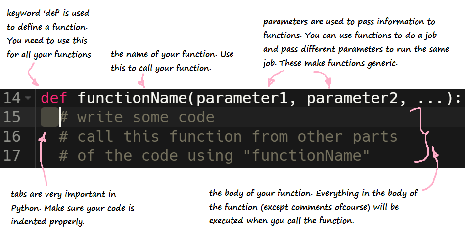

**Funções** são uma forma de organizar partes de código semelhante ou repetido. Em vez de digitar constantemente o mesmo código, podemos colocar o código desejado em uma função e chamá-lo sempre que quisermos usá-lo.

{}
**Observação:** O objetivo de uma função é ajudar a reduzir código redundante
durante todo o programa.
{}

## Criando uma função

### Defina sua função - nome e parâmetros

Para fazer uma função em python, devemos usar a palavra-chave `def`. Esta palavra-chave informa ao editor de código onde a função está definida. `def` é seguido pelo nome da função. O nome da função é usado para chamar sua função de outras partes do programa.
 Para generalizar a função (para que possamos usá-la em vários lugares), talvez precisemos enviar algumas informações para ela. Isto é conseguido usando parâmetros. Eles são colocados entre parênteses `()` e seguem logo após o nome da função. Se nenhum parâmetro for necessário, eles poderão ser ignorados. A declaração da função termina com dois pontos.
 As instruções que são executadas cada vez que a função é chamada seguem nas próximas linhas. As guias são muito importantes aqui, portanto, certifique-se de que seu código esteja recuado corretamente. Cada linha recuada após a linha de definição da função (com exceção dos comentários) será executada quando você chamar a função.

 Esta é a aparência de uma função:

```python
def functionName(parameter1, parameter2, ...):
    # escreva algum código
    # chama esta função de outras partes
    # do código usando functionName
```


{}
Certifique-se de que a primeira linha da sua função sempre termine com dois pontos `:`
{}

### Escreva o corpo da função

Em Python, a indentação define qual código é controlado pela função. No exemplo abaixo, para chamar a função `sectionA`, você deve especificar 2 parâmetros, `startMeasure` e `endMeasure`. Quando você chama `sectionA`, as 3 linhas de função `fitMedia` são executadas. As 2 chamadas de função `fitMedia` na parte inferior estão fora do corpo da função `sectionA`.

```python
#Seção A
def sectionA(startMeasure, endMeasure):
    fitMedia(RD_UK_HOUSE__AIRYPAD_1, 1, startMeasure, endMeasure)
    fitMedia(HOUSE_MAIN_BEAT_002, 4, startMeasure, endMeasure)
    fitMedia(HOUSE_ROADS_BASS_001, 5, startMeasure, endMeasure)

 fitMedia(HOUSE_DEEP_CRYSTALCHORD_001, 3, 1, 5)
 fitMedia(HOUSE_DEEP_CRYSTALCHORD_002, 3, 5, 9)   
```

O código recuado abaixo da função `sectionA` é o código que é executado cada vez que a função `sectionA` é chamada.

{}
**Aviso:** Como a identificação é muito importante em Python, certifique-se
que o corpo da função sempre começa com 2 espaços.
{}

## Retornando um valor
Muitas vezes você não deseja apenas imprimir os resultados ou executar uma ação, mas deseja que a função lhe forneça o resultado da execução da ação. Para fazer isso, você usa a palavra-chave `return`.

```python
def my_function(x):
    return 5 * x

print(my_function(3)) # imprime 15
print(my_function(5)) # imprime 25
```

## Usando a função - Chamada de função

Para chamar uma função, insira o nome da função e seus parâmetros
onde você deseja executar a função. Por exemplo, para chamar a função `sectionA`, faríamos algo assim:

```python
sectionA(1,9)
```

Neste exemplo, `sectionA` será chamado com o valor `startMeasure` como `1` e o valor `endMeasure` como `9`.

{}
**Tenha cuidado:** Ao criar uma função em Python, você deve definir o
função e seu conteúdo antes de ser chamada. Em outras palavras, no
código, você precisa colocar a declaração da função acima da chamada da função.
Caso contrário, você receberá um NameError como abaixo. Veja o seguinte
figura para um exemplo:

{}

### Desafio 1 – Crie sua própria função!

**Desafio:** Crie uma função chamada addNumbers que receba 2 parâmetros chamados número1 e número2 e imprima a soma no console. Chame a função addNumbers com os parâmetros 3 e 5.
O que está impresso no console?

<iframe src="https://trinket.io/embed/python/52ce76e1d0" width="100%" height="600" frameborder="0" marginwidth="0" marginheight="0" allowfullscreen></iframe>

### Desafio 2

Vamos tentar criar algumas funções matemáticas simples. Crie uma função chamada add que receba dois parâmetros, número1 e número2, e retorne a soma dos dois números.

{}

Primeiro copie a estrutura da função tripla. Altere o nome da função tripla e substitua o número do parâmetro por número1 e número2, separados por vírgula. Tanto o número1 quanto o número2 devem ser <font color="blue">int</font> e não se esqueça de adicionar o número1 e o número2 juntos!

{}

Para verificar se sua função está funcionando corretamente, adicione o seguinte código após a definição de sua função, que chama a função add() e salva seu valor em uma variável. Por exemplo:

<pre>
value2 = add(2, 3)
<font color="blue">print</font>("Isso deve imprimir 5: " + str(value2))
</pre>

### Desafio 3

Você pode criar funções para subtração, multiplicação e divisão?

Teste as funções chamando cada função, salvando seu valor de retorno e imprimindo-o no console.