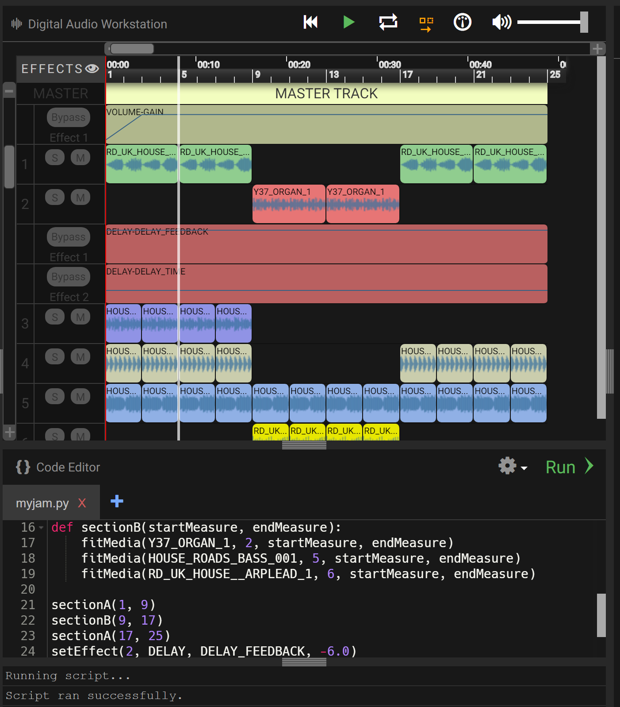

### Vamos fazer música!

Bem-vindo a este guia introdutório sobre como fazer música usando
[EarSketch](https://en.wikipedia.org/wiki/EarSketch) e Python. Para ir para uma atividade específica, você pode clicar no link da seção na barra de navegação à esquerda da página.

<!--- DEIXE ESSE VÍDEO AQUI CASO NECESSITE 
<iframe width="560" height="315" src="https://www.youtube.com/embed/g0u1CkbpUWQ?start=79" frameborder="0" allow="accelerometer; autoplay; encrypted-media; gyroscope; picture-in-picture" allowfullscreen></iframe>
 --->

### Conheça DJ Nuvi

### Nuvi tem novos fones de ouvido! Você consegue encontrar o seu?

Você foi contatado para fazer a próxima mixtape de sucesso do Nuvi, mas quando você chega ao estúdio, Nuvi diz que seu próximo projeto será produzido todo em código. Isso é algo que nunca foi feito antes. Você está à altura do desafio? Olhe ao seu redor para encontrar seus fones de ouvido e prepare-se para se juntar a ele!

Antes de começarmos, certifique-se de que seus fones de ouvido estejam funcionando. Tente reproduzir o seguinte áudio. O que você ouve?!

<figure>
    <audio
        controls
        src="./audio/good-enough.mp3">
            Teste o áudio para ver se o seu navegador suporta o elemento de áudio. Se você não conseguir reproduzir o áudio, provavelmente significa que seu navegador não oferece suporte para isso.
            <code>audio</code> element.
    </audio>
</figure>

## Tabela de Conteúdos

Tabela de Conteúdos

{}

