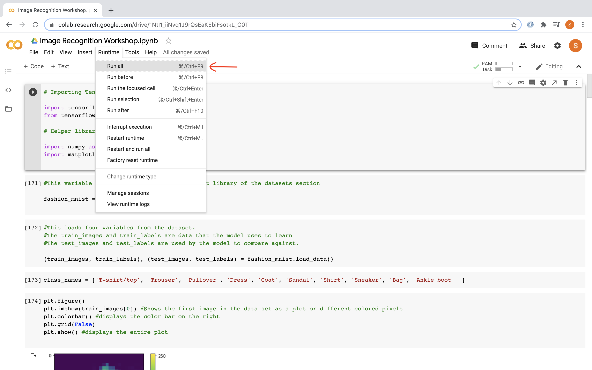

## Bem-vindo ao TensorFlow!

Neste workshop, usaremos a biblioteca Python TensorFlow para treinar um modelo de rede neural capaz de reconhecer e classificar diferentes tipos de roupas. Vamos explorar os passos que permitem ao modelo fazer uma previsão da melhor categoria para uma imagem especificada.

Você também pode usar [este vídeo](https://www.youtube.com/watch?v=FiNglI1wRNk) para acompanhar o workshop e entender melhor o que está sendo abordado.

Os vídeos a seguir mostrarão todo o código e as atividades. Recomendamos que você **faça as atividades primeiro antes de assistir às soluções explicadas**.

<iframe width="560" height="315" src="https://www.youtube.com/embed/6FfxBNRn0Ww" frameborder="0" allow="accelerometer; autoplay; encrypted-media; gyroscope; picture-in-picture" allowfullscreen></iframe>

## Começando com o Google Colab

Acesse o [Google Colab](https://colab.research.google.com/), um ambiente de programação online semelhante ao Google Docs, mas para executar código. Após entrar com sua conta do Google, clique na opção para criar um "Novo Notebook". Para executar o código durante o workshop, clique no botão de "play" à esquerda de cada bloco de código.

Recomendamos que você organize seu código criando um novo bloco para cada segmento usado nas atividades. Além disso, leia os comentários nos blocos de código para entender melhor o que cada trecho faz.

{}
## É necessário ter uma conta do Google

Para usar o Google Colab e editar/executar o código, é necessário estar conectado com uma conta do Google (ou conta escolar com acesso ao Google Drive/serviços do Google).

## Não tem uma conta do Google?

Se você não tiver uma conta Google e não puder criar uma, entre em contato com um dos administradores da Nuevo Foundation para obter acesso temporário a uma conta da Nuevo apenas para este workshop. Lembre-se de que o uso do Google Colab é essencial para que você possa executar todos os códigos deste workshop.

{}

{}
Ao executar seu código pela primeira vez, certifique-se de rodar tudo clicando em _Executar -> Executar tudo_ no menu superior. Isso garante que você não execute funções antes de importar as bibliotecas corretamente!

{}

## Tabela de Conteúdos

Seções

{}

 

<a href="https://www.tensorflow.org/tutorials/keras/classification" target="_blank">Fontes</a>
