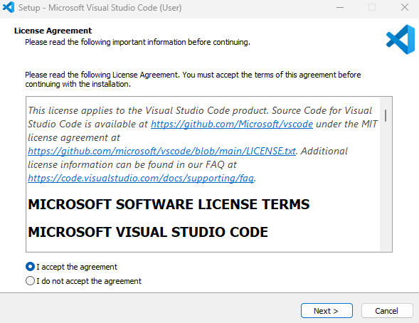

## Boas-vindas

O objetivo da atividade de hoje é aprender habilidades de Web e C# e incorporar seu novo conhecimento para criar um site!

## Iniciando

O objetivo da atividade de hoje é aprender habilidades de Web e C# e incorporar seu novo conhecimento para criar um site! Vamos configurar seu ambiente.

Antes de começar o desenvolvimento de aplicações C#, o primeiro passo é selecionar um ambiente de programação. Para este workshop, escolhemos o Visual Studio Code, um dos IDEs mais populares entre desenvolvedores C#.

### Baixar o Visual Studio Code
1. Abra uma nova janela do navegador e acesse: <a href="https://code.visualstudio.com" target="_blank">https://code.visualstudio.com</a>.

2. Na janela do navegador, selecione o botão Download.

{}
A página de download do Visual Studio Code detecta automaticamente seu sistema operacional. Ela exibe a versão para download de acordo com seu sistema, como Linux, macOS ou Windows.
{}

3. Aguarde o término do download do arquivo do instalador.

O nome do arquivo do instalador será semelhante ao seguinte (para um PC com Windows): VSCodeUserSetup-x64-1.81.0.exe.

{}
O nome do arquivo depende da versão atual do Visual Studio Code e do sistema operacional do seu computador.
{}

4. Feche a janela do navegador.

### Instalar o Visual Studio Code
1. No seu PC, abra um aplicativo de explorador de arquivos e navegue até a pasta de downloads do seu computador.

2. No explorador de arquivos, selecione e execute o arquivo do instalador do Visual Studio Code.

    Em um PC com Windows, você pode dar um duplo clique no arquivo do instalador para iniciar o processo de instalação. Por exemplo, clique duas vezes em VSCodeUserSetup-x64-1.81.0

{}
Você pode instalar o Visual Studio Code usando o Instalador do Usuário ou o Instalador do Sistema. O Instalador do Usuário instala o Visual Studio Code apenas para o usuário atual, enquanto o Instalador do Sistema instala para todos os usuários. O Instalador do Usuário é a opção recomendada para a maioria dos usuários.
{}

Após alguns instantes, a janela de diálogo **Setup - Microsoft Visual Studio Code** aparecerá.

3. Selecione I accept the license agreement e continue seguindo as instruções online para concluir a instalação.

    Aceite as opções padrão durante o restante da instalação.

    Para instruções detalhadas de instalação, consulte a seguinte página da documentação do Visual Studio Code: <a href="https://code.visualstudio.com/docs/setup/windows" target="_blank">https://code.visualstudio.com/docs/setup/windows</a>.

### Instalar o .NET SDK

{}
Você pode verificar se já tem o .NET instalado abrindo uma janela do Terminal e digitando <code>dotnet --version</code> e pressionando Enter.
{}

1. Abra uma nova janela do navegador de Internet.

2. Para abrir a página de download do .NET SDK, acesse:

    <a href="https://dotnet.microsoft.com/download" target="_blank">https://dotnet.microsoft.com/download</a>

3. Na página de download do .NET, selecione a versão recomendada do .NET SDK.

4. Aguarde o término do download do arquivo do instalador.

5. Execute o arquivo do instalador do .NET SDK.

    Em um PC com Windows, você pode encontrar sua pasta de Downloads usando o Explorador de Arquivos. Dê um duplo clique no arquivo de instalação para iniciar o processo.

6. Na janela do instalador do .NET SDK, selecione Install.

7. Aguarde a conclusão da instalação.

    A instalação deve levar cerca de um minuto. Quando a instalação for concluída, uma mensagem será exibida confirmando o sucesso.

8. Para fechar a janela do instalador, selecione Close.

## Índice

Índice

{}

