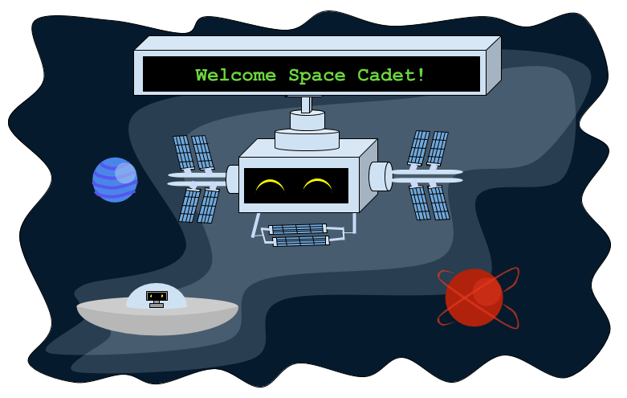

<!-- Link para unidade de imagem SQL: https://drive.google.com/drive/folders/0ADAbCQbzZCAFUk9PVA -->

# Introdução: Aprenda SQL salvando a galáxia!

## Bem-vindo à Estação Espacial Nuevo (NSS)!

Você é um aventureiro espacial que viaja pela galáxia em seu veloz foguete enquanto resolve quebra-cabeças de codificação para ajudar a salvar seus amigos alienígenas em diferentes planetas.
 
Você foi aprovado como explorador espacial honorário pela Federação Galáctica! Você receberá missões para ajudar a tornar a galáxia um lugar seguro e divertido para todos!

{}
Por favor, não use o navegador Firefox para este workshop.
{}

Tabela de Conteúdos

{}

