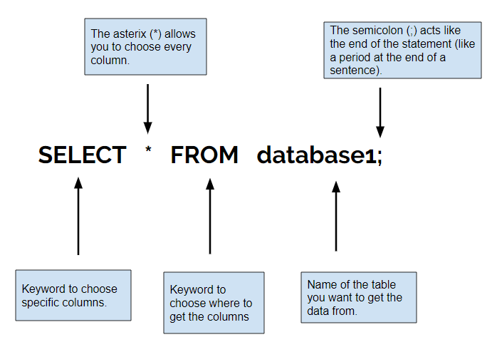

<!-- Links para javascript e CSS necessários para lógica suspensa -->
<link rel="stylesheet" href="../default/_default.css" type="text/css"></link>
<link rel="stylesheet" href="../default/_type.css" type="text/css"></link>
<link rel="stylesheet" href="_activity1.css" type="text/css"></link>

# Missão 1: Salvar o Planeta da Diversão do Tédio!
Sua primeira missão é ir ao Planeta da Diversão e salvá-los do tédio!
Você receberá um banco de dados sobre o planeta e precisa aprender a usar comandos SQL para ajudar a salvar o Planeta da Diversão!

## Tarefa 1: Dê uma olhada nas informações do Planeta da Diversão
Você receberá informações sobre a Galáxia e deseja procurar o Planeta da Diversão. Para fazer isso, a Federação Galáctica deu a você seu primeiro comando SQL: `SELECT`.

{}
### O que o comando faz:
O comando `SELECT` permite escolher quais dados mostrar de um banco de dados.
{}

### Exemplo:

### Agora use o que você aprendeu!
{}
**Arraste os blocos para o terminal e reorganize-os para responder à pergunta abaixo!**
{}

#### Pergunta: Qual comando exibirá todas as colunas do banco de dados chamado "galaxy"?



<!-- Retângulos para receber blocos -->

 

 

 

 

 

 

 

  <!-- style="border: 1px solid green;"> -->

  

  

  

  

 

<!-- Botão Entrar -->
<button class="button button1" onclick="check()">Enter</button>

 <!-- terminal_div -->

 <!-- content_scaler -->

<!-- O banco de dados SQL oculto aparecerá assim que a sequência correta for colocada -->

 
<h1 class="error" id="sqlcommand" style="visibility:hidden"><strong>ERRO ENTRADA INVÁLIDA</strong></h1>
<table id="table">
  <tr></tr>
</table>

<!-- Diz ao usuário para continuar a missão -->

  
Você encontrou o comando correto para exibir todo o banco de dados! Isso é útil quando você deseja ver todas as informações na ponta dos dedos!

  

    &#10003;
    Você completou a tarefa! Continue para a próxima missão!
  


