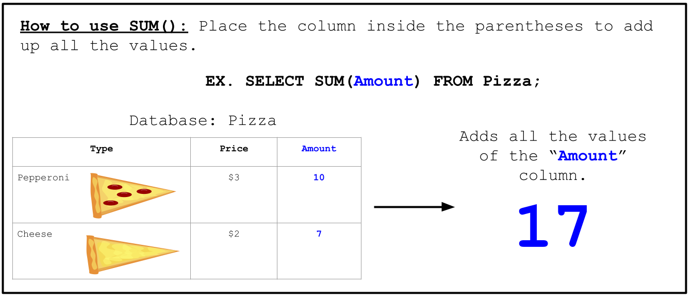

<!-- Links para javascript e CSS necessários para lógica suspensa -->
<link rel="stylesheet" href="../default/_default.css" type="text/css"></link>
<link rel="stylesheet" href="../default/_type.css" type="text/css"></link>

<link rel="stylesheet" href="_activity10.css" type="text/css"></link>

## Devolva os Lendários Totens de Diversão ao Líder

Você encontrou com sucesso os dois Totens Lendários da Diversão! O Líder agradece por encontrar o tesouro perdido.

### O Líder também revela um segredo:
{}
Os Totens Lendários da Diversão não podem liberar todo o seu potencial até que sejam fundidos. Eles só podem ser mesclados pelo "Inventor".

Seu próximo passo é encontrar a pessoa que possa combinar os dois Totens Lendários da Diversão. O "Inventor" só aparecerá se você der uma grande festa!
{}

## Tarefa 10: Ajude os habitantes a se prepararem para a festa!
Todo o planeta está convidado! Ajude os cidadãos a se prepararem para a festa descobrindo quantos convidados estarão presentes!

Vamos examinar o comando `SUM`!

#### Usando o banco de dados 'planet' e o comando `SUM()`, encontre o número total de convidados que comparecerão a esta festa incrível!

{}
Use o comando da atividade 1 para exibir todo o banco de dados.

* Dica 1: O comando segue muito de perto o exemplo e o exemplo `AVG()` (tarefa anterior).
* Dica 2: A coluna 'população' contém informações sobre o número de indivíduos por cidade.
{}

<!-- Atividade de digitação SQL -->



  

    

      <h3 id = "commands" contenteditable="true" onclick="placeholder()">Digite o comando aqui!</h3>
    

    

      <h3 id = "prev"></h3>
    

    

    <button class="button button1" onclick="sql()"> Enter </button>
    

 
    <button class = "button reset" onclick="reset()">Reset</button>
  
 <!-- terminal_div -->

 <!-- content_scaler -->

 
  
<h1 class="error" id="sqlcommand" style="visibility:hidden"><strong>ERRO ENTRADA INVÁLIDA></strong></h1>
  
<table id="table">
  <tr></tr>
</table>
  
<h4 id="story"></h4>
  
<!-- Diz ao usuário para continuar a missão -->

  

    &#10003;
    Você completou a tarefa! Continue para a próxima missão!
  


