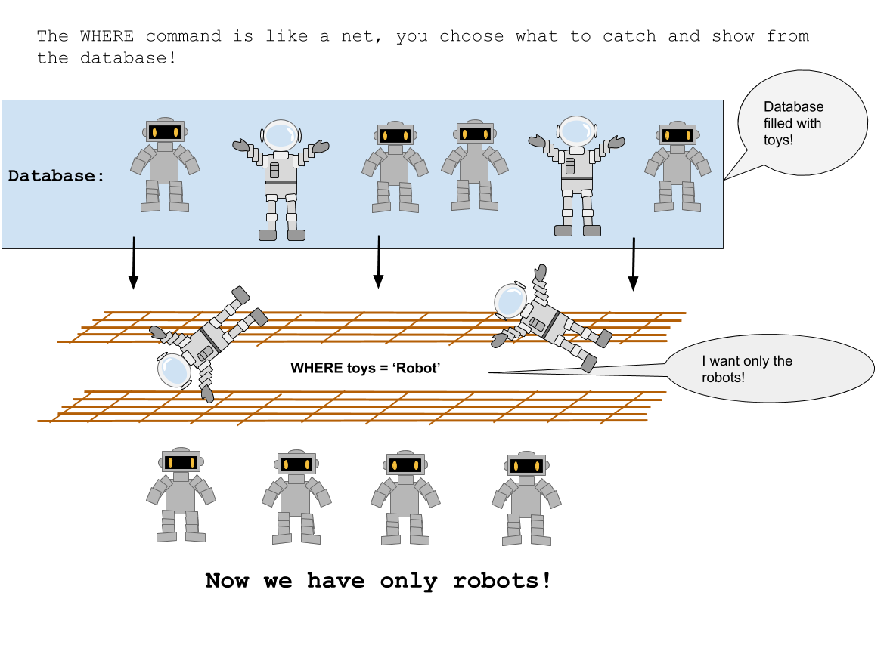
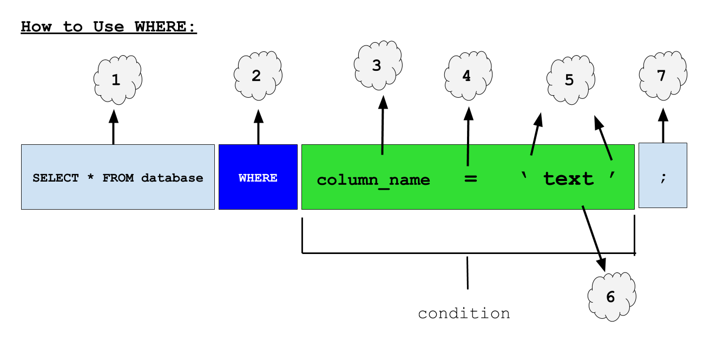
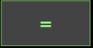
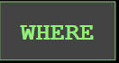

<!-- Links para javascript e CSS necessários para lógica suspensa -->
<link rel="stylesheet" href="../default/_default.css" type="text/css"></link>
<link rel="stylesheet" href="../default/_type.css" type="text/css"></link>
<link rel="stylesheet" href="_activity2.css" type="text/css"></link>

## Tarefa 2: Viaje para o Planeta da Diversão!

Você precisa programar o GPS do seu foguete para ir ao Planeta da Diversão reorganizando os blocos de código. Para encontrar as coordenadas,
a Federação Galáctica deu a você o próximo comando SQL: `WHERE`!

{}
### O que o comando faz:
O comando `WHERE` permite mostrar apenas os dados que você deseja.
{}

### Exemplo:

{}
1. O bloco de banco de dados `SELECT * FROM` que aprendemos na atividade anterior nos permite escolher um banco de dados para pesquisar.

2. O comando `WHERE` nos permite restringir quais dados são exibidos dependendo da condição (os blocos verdes na imagem abaixo). Uma condição é um requisito que você está procurando. As condições não precisam seguir o exemplo acima, mas o uso mais comum de condições é procurar linhas que contenham informações específicas.

3. O nome da coluna na qual desejamos procurar informações.
 
4. O sinal de igual significa que queremos encontrar informações que correspondam ao que temos no lado direito do sinal de igual.

5. Quando procuramos palavras ou textos específicos, devemos colocar o texto entre aspas simples. SQL usa aspas simples para indicar que estamos procurando uma palavra no banco de dados.

6. Você pode substituir 'texto' por qualquer palavra que esteja procurando no banco de dados.

7. O ponto e vírgula funciona como o final de um comando SQL, como um ponto final no final de uma frase.
{}

#### Usando o banco de dados chamado 'galaxy' que possui uma coluna chamada 'planet', encontre as coordenadas do Planeta da Diversão!

<!-- reorganiza os blocos de código no terminal para obter o bloco de coordenadas -->



<!-- Retângulos para receber blocos -->

 

 

 

 

 

 

  

  

  

  

  

  

  

  

<!-- Pressione Enter e se estiver correto, exiba o bloco de coordenadas -->
<button class="button button1" onclick="check()"> Enter </button>

 <!-- terminal_div -->

 <!-- content_scaler -->

<table id="planet" style="visibility:hidden">
  <tr>
  </tr>
  
</table>

<h3> Agora que você sabe onde fica o Planeta da Diversão, podemos encontrar mais informações sobre ele e ignorar os outros planetas. Vamos para o Planeta da Diversão! </h3>

<!-- Diz ao usuário para continuar a missão -->

  

    &#10003;
    Você completou a tarefa! Continue para a próxima missão!
  


