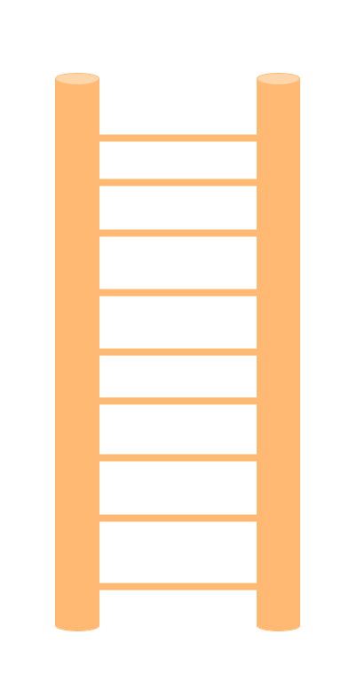

<!-- Links para javascript e CSS necessários para a lógica do menu suspenso -->
<link rel="stylesheet" href="../default/_default.css" type="text/css"></link>
<link rel="stylesheet" href="../default/_type.css" type="text/css"></link>
<link rel="stylesheet" href="_activity5.css" type="text/css"></link>

## Tarefa 5: Encontre a Escada Mais Alta Para Chegar ao Líder Deles

Você descobriu que o líder do planeta está em uma cabana no morro mais alto, mas para chegar lá, você precisa encontrar a escada mais alta na Capital da Diversão!

A Federação Galáctica enviou quatro novos comandos SQL para você brincar! Vamos dar uma olhada neles!

### O que os comandos fazem:

 

{}
Propriedade da Coluna:
`MAX()` é usado para procurar o maior valor em uma coluna. `MIN()` é o oposto de `MAX()` e procurará o menor valor em uma coluna.
Você pode substituir qualquer palavra dentro dos parênteses por outro nome de coluna para obter o maior ou menor valor dessa coluna.
{}

{}
Observe como os itens especificados dentro de `IN()` e `NOT IN()` estão cercados por aspas simples, mas os dentro de `MAX()` e `MIN()` não estão.

 

Condição:
* `IN()` e `NOT IN()` são usados em conjunto com o comando `WHERE` que aprendemos na atividade 2. `IN()` faz parte da condição de um comando SQL e é útil quando você deseja mostrar algumas colunas, mas não todas.

* `NOT IN()` é o oposto de `IN()`. Em vez de escolher o que mostrar como `IN()`, `NOT IN()` mostrará todas as colunas que você não escolheu dentro dos parênteses.

* Você pode usar vírgulas dentro dos parênteses para escolher mais de uma coluna para mostrar ou não mostrar.

* Usar apenas 1 entrada dentro de `IN()` é equivalente a usar `=`:

Ex. `nome_coluna IN('objeto_na_coluna');` é o mesmo que `nome_coluna = 'objeto_na_coluna';`
{}

### Agora use o que aprendeu! Usando o banco de dados chamado 'itens' com colunas rotuladas como 'objeto' e 'altura', encontre a 'escada' mais alta.

{}
Você pode exibir o banco de dados usando o comando da atividade 1.

* Dica 1: Lembre-se do conselho da Federação Galáctica: `SELECT [coluna/propriedade da coluna] FROM [banco de dados] [condição opcional];`

* Dica 2: Propriedade da Coluna: Você precisa usar `MAX()` ou `MIN()` para encontrar a escada mais alta?

* Dica 3: Condição: `WHERE [nome_da_coluna] [IN/NOT IN];`

* Dica 4: Você precisa usar `IN()` ou `NOT IN()` para mostrar a 'escada'?

* Dica 5: Qual símbolo você precisa no final de um comando SQL?
{}
 
{}
* BÔNUS: Tente usar várias entradas dentro de `IN()` ou `NOT IN()` ao procurar a escada
* Este comando é muito poderoso para buscar vários tipos de objetos
{}

{}
Lembre-se: Você pode consultar o banco de dados várias vezes usando tudo o que aprendeu até agora para descobrir a cor da escada mais alta.
{}

<!-- Digitação SQL na Atividade -->



  

    

      

        <h3 id = "commands" contenteditable="true" onclick="placeholder()">Type command here!</h3>
      

      

        <h3 id = "prev"></h3>
      

        

 
      <button class="button button1" onclick="sql()"> Enter </button>
      

 
      <button class = "button reset" onclick="reset()">Reset</button>
    
 <!-- terminal_div -->
  
 <!-- content_scaler -->
  

  <h1 class="error" id="sqlcommand" style="visibility:hidden"><strong>ERRO ENTRADA INVÁLIDA></strong></h1>
  <table id="table">
    <tr></tr>
  </table>
  
  <h4 id="story"></h4>

  

      
    
 Escada VERMELHA = 100 

    
 Escada VERDE = 60 

    
 Escada AMARELA = 20 

     
  



### Escolha e segure a escada correta até o morro para continuar sua aventura!

{}
A escada correta será destacada em verde.
{}



<!-- Player drags ladder block to drop block to finish mission -->

<!-- Drop Location -->

 

<!-- Drag Block -->

  

  

  

 <!-- hill_div -->

 <!-- content_scaler -->

 

<!-- O texto da próxima missão é exibido -->

  
 Você conseguiu! O Líder lhe conta que o Planeta da Diversão está em perigo de ser invadido pelos alienígenas do Planeta do Tédio!
  Você precisa encontrar os Totens da Diversão para salvar o planeta! 

<!-- Indica ao usuário para continuar a missão -->

  

    &#10003;
    Você completou a tarefa! Continue para a próxima missão!
  


