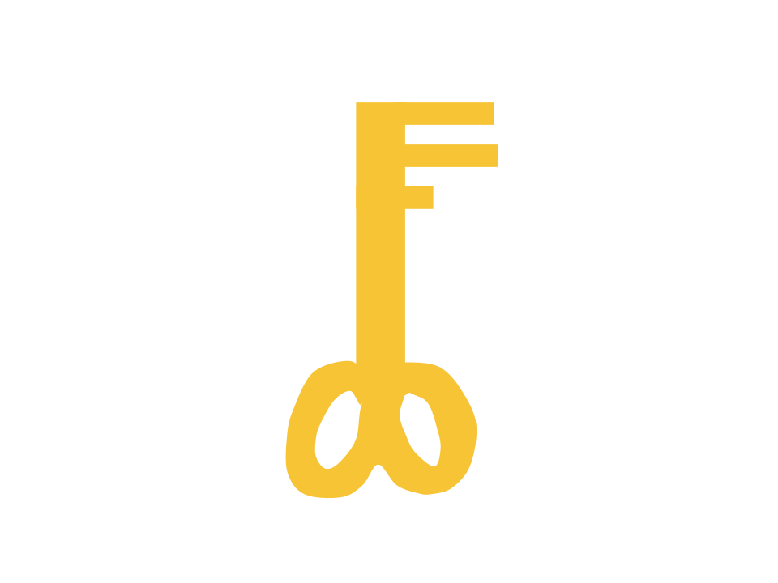

<!-- Links para javascript e CSS necessários para lógica suspensa -->
<link rel="stylesheet" href="../default/_default.css" type="text/css"></link>
<link rel="stylesheet" href="../default/_type.css" type="text/css"></link>
<link rel="stylesheet" href="_activity7.css" type="text/css"></link>

## Tarefa 7: Encontre a chave para chegar ao canhão de confete!

Você encontrou a localização do Canhão de Confete Lendário, mas ele está trancado atrás de uma porta feita de titânio
e só pode ser desbloqueado com a menor chave do planeta!

**Para ajudá-lo, a Federação Galáctica enviou-lhe um lembrete sobre como usar `MIN()` de uma atividade anterior.**

#### Usando o banco de dados chamado <i>'items'</i> com colunas rotuladas <i>'object'</i> e <i>'height'</i>, encontre a <i>'key'</i > (chave) com a menor altura.
{}
Você pode exibir todo o banco de dados usando o comando da atividade 1.

* Dica 1: Lembre-se do conselho da Federação Galáctica: `SELECT [coluna/propriedade da coluna] FROM [banco de dados] [condição opcional];`

* Dica 2: Condição: `WHERE [column_name] [IN()/NOT IN()];`

* Dica 3: Você precisa usar `IN()` ou `NOT IN()` para mostrar a 'chave'?
{}
<!-- Atividade de digitação SQL -->



  

    

      

        <h3 id = "commands" contenteditable="true" onclick="placeholder()">Digite o comando aqui!</h3>
      

      

        <h3 id = "prev"></h3>
      

      

 
      <button class="button button1" onclick="sql()"> Enter </button>
      

 
      <button class = "button reset" onclick="reset()">Reset</button>
    
 <!-- terminal_div -->
  
 <!-- content_scaler -->
  

 
  <h1 class="error" id="sqlcommand" style="visibility:hidden"><strong>ERRO ENTRADA INVÁLIDA></strong></h1>
  <table id="table">
    <tr></tr>
  </table>
  <h4 id="story"></h4>

<h4 id="story"></h4>

 


### Escolha e arraste a chave correta para a fechadura para continuar sua aventura!
{}
A altura (height) corresponde ao número de voltas na base da chave. A chave correta será destacada em verde.
{}



  <!-- O jogador arrasta o bloco-chave para soltá-lo e terminar a missão -->
  

    

    

 

    <!-- Position of first key -->
    

      
    
 

    <!-- Drag Block -->
    

      
    
 

    

      
    
 

    <!-- Drop Location -->
    
 

  
 <!-- door_div -->

 <!-- content_scaler -->

<!-- O texto da próxima missão é exibido -->

  <h3> Você encontrou o Lendário Totem da Diversão: Canhão de Confete! </h3>

<!-- Mostrar o canhão de confete -->

<!-- Diz ao usuário para continuar a missão -->

  

    &#10003;
    Você completou a tarefa! Continue para a próxima missão!
  


