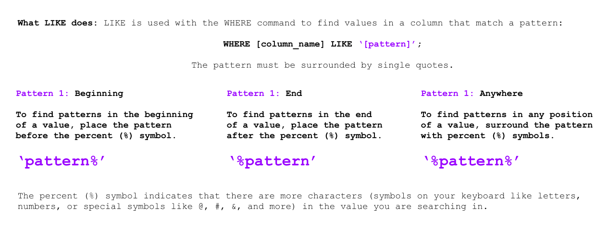

<!-- Links para javascript e CSS necessários para lógica suspensa -->
<link rel="stylesheet" href="../default/_default.css" type="text/css"></link>
<link rel="stylesheet" href="../default/_type.css" type="text/css"></link>

<link rel="stylesheet" href="_activity8.css" type="text/css"></link>

## Tarefa 8: Encontre o Lendário Totem da Diversão: Mesa de Buffet Infinita

Outro artefato que você deve encontrar é a mesa buffet infinita de diversão! As lendas dizem que os festivais nunca acontecerão
sem comida com esta mesa de buffet mística.

{}
Este Totem foi criado um mês após o artefato anterior:
o Canhão de Confete (lembrete: o Canhão de Confete foi criado em 12/09/1738).
{}

**A Federação Galáctica enviou a você um breve tutorial sobre um comando útil: `LIKE`**

#### Usando o banco de dados chamado 'items' com uma coluna chamada 'date_created', encontre a Tabela Buffet Infinita!
{}
Você pode usar o comando na atividade 1 para exibir todo o banco de dados.

* Dica 1: O formato da data é Ano-Mês-Dia.
* Dica 2: Este Totem foi criado um mês DEPOIS do Canhão de Confete (12 de setembro de 1738).
* Dica 3: Qual é o padrão? Precisa procurar o mês no início, no final ou em qualquer lugar do valor?
{}
<!-- Atividade de digitação SQL -->



  

    

      

        <h3 id = "commands" contenteditable="true" onclick="placeholder()">Digite o comando aqui!</h3>
      

      

        <h3 id = "prev"></h3>
      

      

 
      <button class="button button1" onclick="sql()"> Enter </button>
      

 
      <button class = "button reset" onclick="reset()">Reset</button>
    
 <!-- terminal_div -->
  
 <!-- content_scaler -->
  

 
  <h1 class="error" id="sqlcommand" style="visibility:hidden"><strong>ERRO ENTRADA INVÁLIDA></strong></h1>
  <table id="table">
    <tr></tr>
  </table>
  <h4 id="story"></h4>

  <h4> Você encontrou a localização do Lendário Totem da Diversão: Mesa de Buffet Infinita! Agora viajaremos para Capital da Diversão!</h4>

 

<!-- Mostrar a localização da mesa do buffet -->

<!-- Diz ao usuário para continuar a missão -->

  

    &#10003;
    Você completou a tarefa! Continue para a próxima missão!
  


