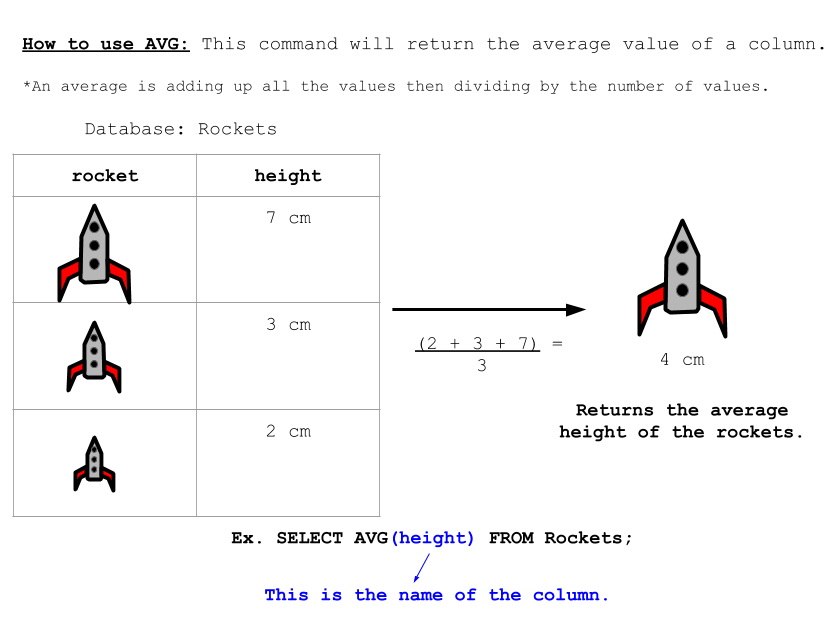

<!-- Links para javascript e CSS necessários para lógica suspensa -->
<link rel="stylesheet" href="../default/_default.css" type="text/css"></link>
<link rel="stylesheet" href="../default/_type.css" type="text/css"></link>

<link rel="stylesheet" href="_activity9.css" type="text/css"></link>

## Tarefa 9: Desbloqueie a Mesa de Buffet Infinito:

Você descobriu a localização da Lendária Mesa de Buffet Infinita! No entanto, está trancado atrás de uma porta que
só será desbloqueado se você encontrar o número secreto.

{}
Sua única pista é que a combinação representa os dois primeiros dígitos da população média da cidade.
{}

**Vejamos o comando `AVG()`!**

#### Usando o banco de dados 'planet' e o comando `AVG()`, encontre os dois primeiros dígitos da 'population' (população) média da cidade!
{}
Use o comando da atividade 1 para visualizar todo o banco de dados.

* Dica 1: O comando segue muito de perto o exemplo.

* Dica 2: Como você usa 'população' com o comando `AVG()`?
{}
<!-- Atividade de digitação SQL -->


  

    

      

        <h3 id = "commands" contenteditable="true" onclick="placeholder()">Digite o comando aqui!</h3>
      

      

        <h3 id = "prev"></h3>
      

      

 
      <button class="button button1" onclick="sql()"> Enter </button>
      

 
      <button class = "button reset" onclick="reset()">Reset</button>
    
 <!-- terminal_div -->
  
 <!-- content_scaler -->
  

 
  <h1 class="error" id="sqlcommand" style="visibility:hidden"><strong>ERRO ENTRADA INVÁLIDA></strong></h1>
  <table id="table">
    <tr></tr>
  </table>
  <h4 id="story"></h4>



### Descubra a combinação para desbloquear o cofre!
{}
A pista para a combinação está no topo desta página!
{}



  

    

    <button class="button first_up" id = "first_up" onclick="add(1)"> + </button>
    <button class="button sec_up" id = "sec_up" onclick="add(2)"> + </button> 
    
    

 
    
    <textarea class="lock" id="lock1" readonly>0</textarea>
    <textarea class="lock" id="lock2" readonly>0</textarea>
    
    <button class="button first_down" id = "first_down" onclick="subtract(-1)" style="clear:left;"> - </button>
    <button class="button sec_down" id = "sec_down" onclick="subtract(-2)"> - </button>
    

    

    <button class="button vault_button" id = "vault_button" onclick="confirm()"> Check </button>
    

    
    

 

  
 <!-- vault_div -->

 <!-- content_scaler -->

 

<h5 id="plot" style="visibility:hidden"> Você conseguiu, Explorador Espacial! Você encontrou o Lendário Totem da Diversão: Mesa de Buffet Infinita! </h5> 

<!-- Mostrar a mesa do buffet infinito -->

<!-- Diz ao usuário para continuar a missão -->

  

    &#10003;
    Você completou a tarefa! Continue para a próxima missão!
  


