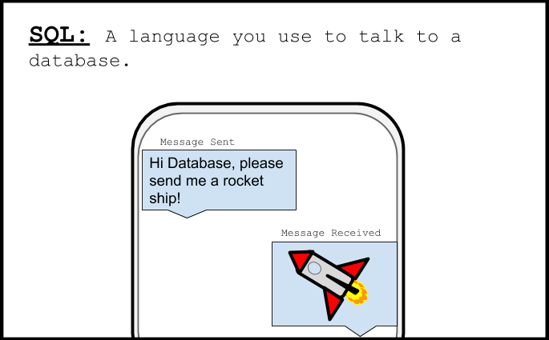

# Treinamento de cadetes!
Como um novo explorador espacial honorário, vamos repassar alguns princípios básicos!

## O que é um banco de dados?

 É uma espécie de contêiner para você guardar e organizar informações.
Pense em um banco de dados como um balde onde você pode colocar os brinquedos para que não se percam
e você pode encontrá-los facilmente mais tarde. Este balde pode conter baldes menores para classificar
seus brinquedos.

## O que é SQL?

SQL significa “Structured Query Language” e como seu nome,
é uma linguagem que permite conversar com o banco de dados para obter as informações
que você precisa. Um comando SQL é como uma frase que você diz ao banco de dados.

## O que é uma Tabela?

Uma tabela pode ser um banco de dados.

Agora que você tem algum conhecimento do que são bancos de dados e comandos SQL, você aprenderá
 como usá-los em suas missões! Continue a iniciar sua primeira aventura
 espacial oficial!
