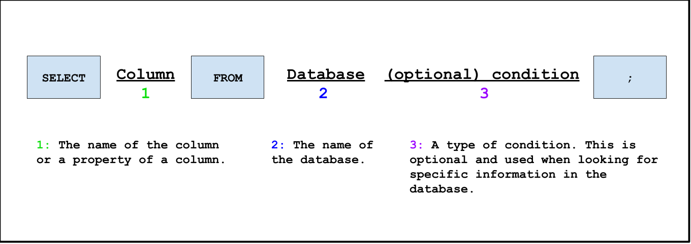

## Um e-mail da Federação Galáctica?
No meio da sua jornada, você recebe de repente uma mensagem da Federação Galáctica. Sobre o que poderia ser?

 

Remetente: A Federação Galáctica

Receptor: Cadete Espacial

Assunto: Terminal atualizado

 

Caro Cadete Espacial,

 

Nossos registros indicaram que você aprendeu comandos suficientes para aprender a estrutura básica dos comandos SQL.
**A Federação Galáctica tomou conhecimento de suas conquistas e decidiu conceder a você um terminal atualizado!**
Durante sua jornada, você precisará de seu prático terminal para exibir informações sobre o planeta ao seu redor. Agora você pode digitar comandos!

 

De acordo com as Diretrizes do Explorador Espacial, iremos agora falar sobre a estrutura central de um SQL
comando na esperança de que você seja capaz de superar os desafios que ainda estão por vir.

<!--{}
* Os nomes de colunas e bancos de dados ** diferenciam maiúsculas de minúsculas **, isso significa que se os nomes estiverem todos em letras minúsculas, certifique-se de que estejam em letras minúsculas ao digitá-los!
* Por favor, não esqueça o ponto e vírgula no final de um comando SQL!
{}-->

Esperamos que nossos conselhos o ajudem em sua jornada. Boa sorte, Cadete Espacial!

 

Desejamos a você uma boa aventura,

 

A Federação Galáctica
