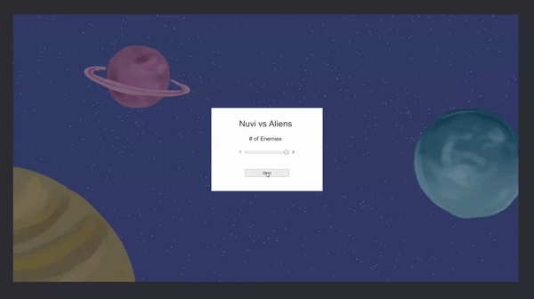

## Introdução

Oh não! Alienígenas desceram à Terra! Você aceitará o desafio e ajudará o robô Nuvi a derrotar os alienígenas?

Este workshop irá guiá-lo passo a passo na criação de um jogo espacial Unity!

Espero que goste!

## Tabela de Conteúdos

{}
