# Starting Up
We will alternate between two browser tabs during this activity.

## Using Repl.it
Open your favorite internet browser (such as Edge, Firefox, Google Chrome, Internet Explorer) and go to [https://repl.it](https://repl.it). Scroll to the bottom of the page, look for ‘languages', search for C#, and click it.

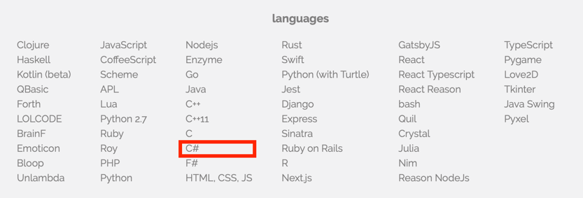

You should see the following screen:

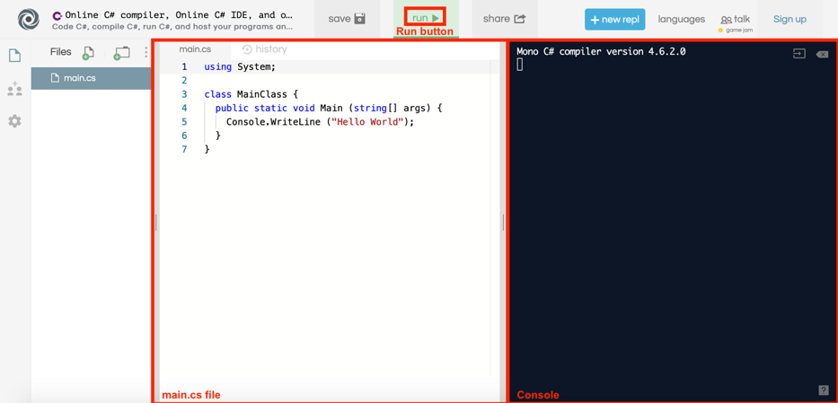

We will ignore some of the details on this screen, but we will go over some of the basics that show up. The main.cs file contains code, or instructions for the computer to run. Press the **run** button to tell the computer to perform the instructions in the code. Any results from running the code will be displayed on the right side, called the console.

Any activities under the **Working Together** sections will be done in this browser tab, working together with the instructor.

## Setting up the project
The goal of today's activity is to learn C# skills and incorporate your new-found knowledge to create a GuessTheWord game! Let's get the game set up.

In a new browser tab, go to [https://aka.ms/nuevoguesstheword](https://aka.ms/nuevoguesstheword). Your screen should look like this:

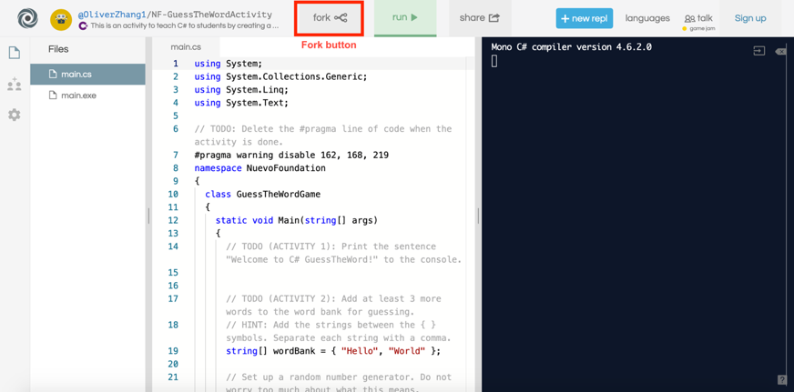

Click the Fork button to create a copy of the code for yourself to work on. Any activities under the **Activity** sections will be done in this browser tab. You will do these activities on your own, but helpers are available when you are stuck.

# The Basics
## Writing to Console
`Console.WriteLine` means to tell the computer to print the sentence enclosed within the parentheses `()` out onto the console. To try it out, press **run**. You see that `Hello World` is printed out to the screen on the right.

### Working Together
1.	Without removing the quotation marks, try changing `"Hello World"` to another sentence. Press **run** to see if anything changes.
2.	Add another `Console.WriteLine` below the current line to print a second sentence below the first sentence.
3.	Press **run** to see if two sentences are printed out. If you see any red text, please ask for help.

We will use printing heavily in the later lessons, so make sure you understand this before continuing!

### HELP! I got a lot of red text!

If you see any red text, you have encountered some errors! Please ask for help or check the debugging page at the end of this tutorial. Beware of the following when coding in C#:

1.	The `c` in `Console`, and the `w` and `l` in `WriteLine` are capitalized. 
2.	There is a semicolon `;` at the end of the line.
3.	Make sure the sentence you wish to print is surrounded in quotation marks, and that the sentence is between the parentheses.
4.	Do not delete any curly braces `{` or `}`.

## Comments
Developers often need to collaborate with other developers. Comments are an easy way for developers to write notes in the code and communicate with others. Comments are ignored by the computer; thus, they are also an easy way to tell the computer to not run certain lines of code. There are two ways to create comments:

1.	To comment out one line, place `//` in front of a line of code. For example:

```csharp
// This is a single-line comment. 
```

2.	To comment out multiple lines at once, indicate the start of the comment with `/*` and the end of the comment with `*/`. For example:

```csharp
/* This is a multi-line comment.
   This line is also part of the comment. */
```

To remove a comment (or uncomment a line), simply delete the `//` for a single-line comment, or the `/*` and the `*/` characters for the multi-line comment.

### Working Together
1.	Place `//` in front of `Console.WriteLine("Hello World");`. After pressing **run**, check to make sure that `Hello World` is not printed to the console.
2.	Delete the `//` and instead, surround `Console.WriteLine("Hello World");` with `/*` and `*/`. Check that `Hello World` is still not printed to the console after pressing **run**.
3.	Delete both `/*` and `*/`, and press **run**. `Hello World` should now be printed to the console.

Throughout today's activity you will see various multi-line comments and `// TODO` comments. These comments will guide us towards completing the Guess the Word game, so be sure you understand how to comment and uncomment code.

### Activity 1
Go to the code containing the GuessTheWord game. Press **run**. Notice that `Press 'run' on the top of the screen to play again.` is the only thing that is printed to the console. Let's add a welcome message so that the player knows they playing the Guess the Word game.

Find `// TODO (ACTIVITY 1)` in the code. Add a line of code to print Welcome to C# GuessTheWord to the console. If you did this correctly, `Welcome to C# GuessTheWord` will be printed to the console after pressing **run**.

## Strings
Anything that is surrounded in quotation marks is called a string. This is how a computer represents words or sentences. For example, `"a"`, `"2"`, `"banana!"`, and `"Hello World"` are strings, but `Hello World` and `2` are not strings, because the quotation marks are missing.

You can combine many strings together using the `+` operator. For example:

- `"Apple" + "Pineapple"` produces the string `"ApplePineapple"`.
- `"Nuevo" + " " + "Foundation"` produces the string `"Nuevo Foundation"`.


### Working Together
Delete all your `Console.WriteLine` text in your code. Start your code with the line `Console.WriteLine("Nuevo" + " " + "Foundation");`.

Note that there are many ways to combine strings together. For example, another way to print Nuevo Foundation would be to write `Console.WriteLine("Nue" + "vo Fou" + "ndation");`.

We will brainstorm at least one more way to print the string `"Nuevo Foundation"` using two `+` symbols in each `Console.WriteLine` statement. Verify that Nuevo Foundation is printed out 3 times. In other words, your console should look like this after you press **run**:

```
Nuevo Foundation
Nuevo Foundation
Nuevo Foundation
```

### Activity 2
Find `// TODO (ACTIVITY 2)` in the GuessTheWord code. For the Guess the Word game, we will give the computer a word bank, and the computer will choose one of the words randomly to use for the game. So far, we have added the words `"Hello"` and `"World"` to the word bank. However, a Guess the Word game with only two possible words to guess is not fun at all! Add at least 3 more strings to the word bank.

***Note:*** The console output will not change from the previous activity. We do not want to tell the player the words inside the word bank when they play the game! For this activity, just make sure that you do not get any error messages in the console after pressing **run**.

## Numbers
The computer can also do regular math that you see in school. Use `Console.WriteLine` to print out the result from the math expressions. No quotation marks are needed for numbers!

```csharp
Console.WriteLine(5 + 4);
Console.WriteLine(6 * (9 - 7) / 3);
```

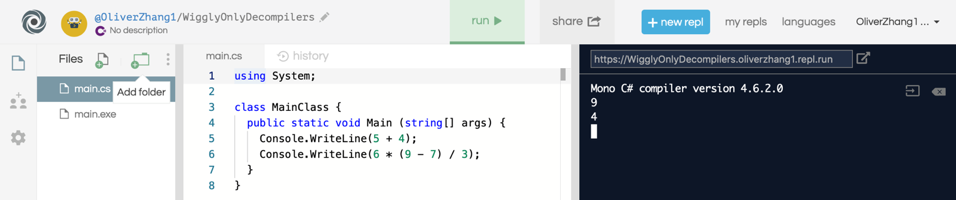

Here is the full list of math symbols that you can use:

Operator | Description | Operator | Description
-------- | ----------- | -------- | -----------
`+`      | Add         | `\`      | Divide
`-`      | Subtract    | `%`      | Modulo (remainder)
`*`      | Multiply    | `(`,`)`  | Parenthesis

### Fun Fact: Computer Division
The computer does division differently from your regular calculator. Computer division will exclude remainders or decimals. For example, `15 / 4` produces `3`, and not `3.75`.

### Working Together
Delete all your `Console.WriteLine` text in your code.

Try printing out the answers to the following to the console. Ensure your brackets are matched. Use a calculator (or mental math) to verify the computer produced the correct answer.

- `2 - 19`
- `(3 + 5) * 6`
- `(13 + 5 * 8) / (6 - (3 + 7))`

### Fun Fact: Random Numbers
Here is how to print a random number between `1` (inclusive) and `10` (exclusive):

```csharp
Random random = new Random(); 
Console.WriteLine(random.Next(1, 10));
```

Try to find where we use `Random` in the GuessTheWord game! However, the details as to how this works is complicated, so we will skip this discussion.

## Booleans
**Booleans** are `true` or `false` statements. Unlike strings or numbers, booleans store statements of truth: is what I am saying true or false? For example, if I ask, "Are you a robot?", this question produces a `true` or `false` result, which we call a **Boolean**. In this case, since you are not a robot (hopefully!), we would produce `false`.

We can also use math operators to create boolean expressions. Here are some examples; however, notice the unusual symbols for "equal to" and "not equal to":

Operator | Description           | Operator | Description
-------- | --------------------- | -------- | -----------
`<`      | Less than             | `>`      | Greater than
`<=`     | Less than or equal to | `>=`     | Greater than or equal to
`==`     | Equal to              | `!=`     | Not equal to

As usual, use `Console.WriteLine` to print out your results:

```csharp
Console.WriteLine(10 < 8);
Console.WriteLine((3 * 6) == (32 - 14));
```

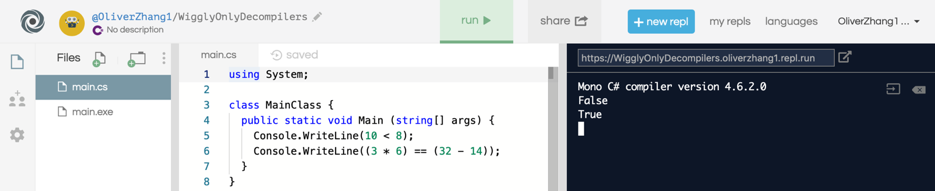

### Working Together
Delete all your `Console.WriteLine` text in your code.

Try guessing the answers to the following expressions. Use `Console.WriteLine` to check your answers.

- `54 < (10 + 32)`
- `(37 / 5) == 7`
- `"Hello" + "World" == "Hello World"`
- `false == false`

## Booleans Operators
You can also connect boolean expressions together using the `&&` (AND) and the `||` (OR) operator. For example, suppose I ask: "Are you a human, and is Nuvi a robot?" The word "and" connects the two true-false questions together. In this case, since it is true that you are a human, and it is also true that Nuvi is a robot, then the overall result is `true`.

Here's a chart that describes what happens when we connect booleans together:

Expression       | Result  | Expression                            | Result
---------------- | ------- | ------------------------------------- | ------
`true && true`   | `true`  | <code>true &#124;&#124; true</code>   | `true`
`true && false`  | `false` | <code>true &#124;&#124; false</code>  | `true`
`false && true`  | `false` | <code>false &#124;&#124; true</code>  | `true`
`false && false` | `false` | <code>false &#124;&#124; false</code> | `false`

To summarize, `&&` requires both Boolean expressions to be true, while `||` only requires one of the two Boolean expressions to be `true`. Here are some more examples:

- `(5 < 8) && (9 != 10)` produces `true` since both `5` is less than `8` and `9` is not equal to `10`.
- `(8 <= 2) || ("h" + "e" == "he")` produces `true` since `"h" + "e"` results in `"he"`, even though `8` is not less than or equal to `2`.
- `(6 != 2 * 3) || (8 < 2 * 4)` produces `false` since both `6` not equal to `2 * 3`, and `8` not being less than `2 * 4`, produce `false`.

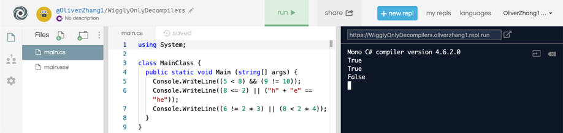

### Working Together
Delete all your `Console.WriteLine` text in your code.

Try guessing the answers to the following expressions. Use `Console.WriteLine` to print out the answers.

- `(9 < 10) && (12 => 11)`
- `(15 - 2 == 11) || (4 % 3 != 2)`

## Variables
Variables are simply names that we can give to values such as strings, numbers and booleans. We use variables to store information that the computer can keep track of.

Here's how to declare a variable named `str`. We say `str` has the value `"Hello World"`. Can you describe what the other variables below mean?

```csharp
var str = "Hello World";
var x = 88;
var happy = true;
```

Press **run**. Note that variables are not printed out to the console. Instead, the variable simply stores the string or number or boolean into the computer's memory. We can use these variables in other statements. For example, the following code would print `Hello Nuevo Foundation` to the console:

```csharp
var str1 = "Hello";
var str2 = "Nuevo Foundation";
Console.WriteLine(str1 + " " + str2);
```

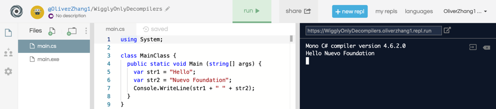

You can change the value of a variable at any time by using the `=` operator again. If you're changing a value of a variable, you don't need to use `var` again. In the following example, `Hola` will be printed instead of `Hello`.

```csharp
var str = "Hello";
str = "Hola";
Console.WriteLine(str);
```

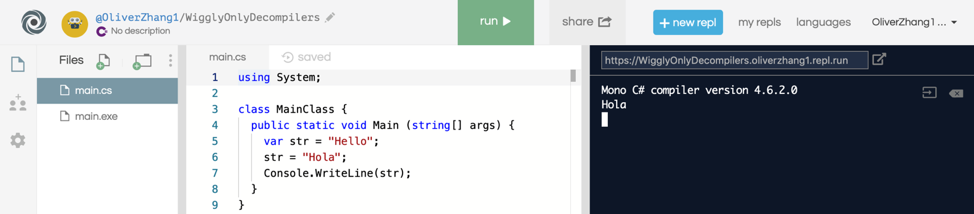

Here's another example: `10` will be printed instead of `9`.

```csharp
var num = 9;
num = num + 1;
Console.WriteLine(num);
```

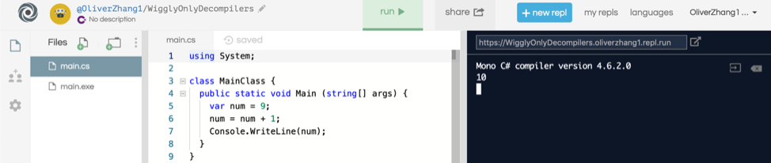

Note that you CANNOT replace a string variable with a number or a boolean, and similarly for other combinations. The following example code will NOT work:

```csharp
var happy = "Hello";
happy = 9;
```

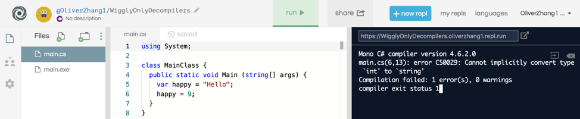

Another way to declare variables is to replace var with the type (`string`, `int`, `bool`) of variable you are creating. By declaring the type explicitly, you avoid the problem that we see above. For example:

```csharp
string str = "Hello World";
int x = 88;
bool happy = true;
```

Note that `var`, `string`, `int`, or `bool` are special keywords in C#, so you cannot create variables with those names.

### Working Together
Let's create two new variables:

- A variable named comp that stores the string `"Computer"`.
- A variable named five that stores the number `5`.

Next, let's use the variables to print out (`Console.WriteLine`) the following to the console. Let's try to do this while using the variables!

***Hint:*** we will use the `+` operator to combine strings together, and to also add numbers together.

```
Computer
5
ComputerComputer
10
ComputerComputerComputer
15
```

### Activity 3
This activity is split into 2 parts and will test your knowledge about variables.

#### Activity 3.1
At the start of the game, we should tell the player how many letters the word to guess has. For example, if the word to guess is `"Hello"`, we should tell the player: `The word has 5 letters`. We have already stored the number of letters in the `numberOfLetters` variable, so use it to complete this activity.

To check if you have completed this activity correctly, press **run**, and make sure you see `The word has 5 letters` (or some number other than 5) in the console.

#### Activity 3.2
There are three pieces of information that we need the computer to store:

- The number of lives.
- The number of letters that the player has guess correctly so far.
- Whether or not the player won the game.

We will declare three variables to represent these pieces of information. Press **run** to make sure no errors appear in the console. Remember that variables do not produce console output, so for this part, we are only checking for the absence of errors.

## Reading from Console
Now that we know the basics about variables, we can now accept input from the user. Use the following line to tell the console to wait until the user types something into the console. Then, the computer takes whatever is typed into the console, and stores it into the variable called `input`.

```csharp
var input = Console.ReadLine();
```

Here's an example of how to use `Console.ReadLine` to accept user input:

```csharp
Console.WriteLine("Type in something:");
var input = Console.ReadLine();
Console.WriteLine("You typed in: " + input);
```

When the user presses **run**, the user is greeted with the following program:

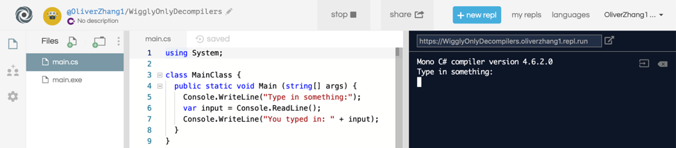

In this case, after the user types in `Hello World!` into the console, the program finishes outputting to the console:

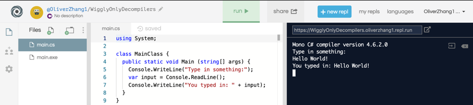

### Working Together
Write a program that first prints the following two lines to console:

```
Welcome!
How can I help you today?
```

Afterwards, the console waits for user input. After the user types in something and presses Enter, the computer prints out:

```
You asked: [input]?
I don't know the answer to that! Goodbye!
```

`[input]` should be replaced with whatever the user had typed into the console.

### Activity 4
This activity has four parts. This is a great time to use your knowledge of comments, numbers, variables, and reading from console to complete the 4 activities. Some background information for each activity is provided below, and hints are provided in the code. After each part, press **run** and make sure there are no errors present in the console.

#### Activity 4.1
First, let's introduce some more code into our game. Find the two lines of code which start with `TODO (ACTIVITY 4.1)` (one is at approximately line 60, and the other at approximately line 130). Delete both lines of code entirely. This unlocks the main behavior of the game, such as checking if the letter guessed by the player is found in the word to guess.

Unfortunately, after pressing **run**, it seems like the game does not wait for user input, and continuously guesses `'C'` instead! This is no good, so let's fix this in the next part.

#### Activity 4.2
When the player makes a guess, we need to take the guessed letter and store it in a variable. The variable will be used to check if the letter appears in the word to guess. Use `Console.ReadLine` to wait for user input and store the user input in the input variable. Note: we have already declared the variable input already, so you do not need to use the `var` keyword.

To check if you have done this correctly, press **run**, and you should now be able to type in a letter into the console.

#### Activity 4.3
Every time a letter is guessed correctly, we need to increment (add one to) the number of correctly guessed letters. Use the `lettersRevealed` variable to change the number of correctly guessed letters.
Press **run** to make sure no errors occur. We have also provided some code to print out the value of the `lettersRevealed` variable for testing purposes. Make sure to delete this when you are done testing, since this is something we do not want to reveal to the player!

#### Activity 4.4
Every time a letter is guessed incorrectly, the player loses a life. Decrement (subtract one from) the number of lives, using the `lives` variable. We will also tell the player how many lives they have remaining, when they make an incorrect guess, by printing the number of lives to the console.
Check if you have done this correctly by pressing **run**, guessing an incorrect letter, and seeing if the correct number of lives are displayed on the console.

### Fun Fact - Bugs
Recall in **Activity 4.1** that after uncommenting some code, we experienced some unexpected behavior. Any problems or unexpected behaviors in the program are called **"bugs"**. We fixed the bug introduced in **Activity 4.1** by introducing user input in **Activity 4.2**.

Even if you implemented everything correctly in the previous parts, if you keep playing for a while, another issue still occurs. What is it? We will fix this bug in **Activity 6**.

# Branching and Loops
## If-else statements
You can use `if` statements to **run** code statement only if certain conditions are met. Here is an example:

```csharp
var myNum = (93 + 41) / 12;
if (myNum == 11)
{	
    Console.WriteLine("They are equal!");
}
```

Inside the `()` beside `if`, you should specify a boolean expression. If the expression is `true`, the code inside `{ }` is executed. In this case, since `myNum` is equal to `11`, `They are equal!` is printed.


If the condition is `false`, nothing happens! For example, since `10` is not greater than `11`, `Print me!` will not show up to the console.

```csharp
var happy = 10;
if (happy > 11)
{	
    Console.WriteLine("Print me!");
}
```

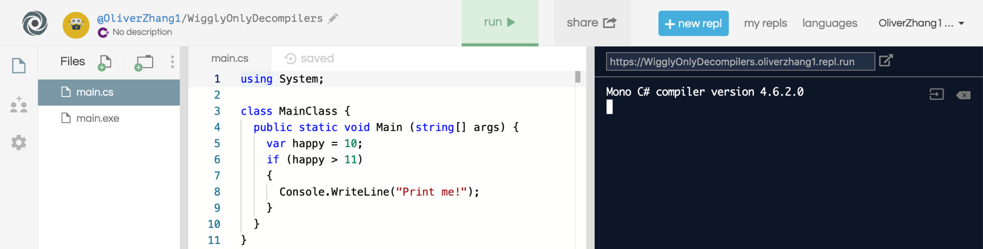

Use `else` to tell the computer what to do if the condition is false. In this example, `now I got printed instead!` will be printed to the console.

```csharp
var happy = 10;
if (happy > 11)
{
    Console.WriteLine("Print me!");
}
else
{
    Console.WriteLine("I got printed instead!");
}
```

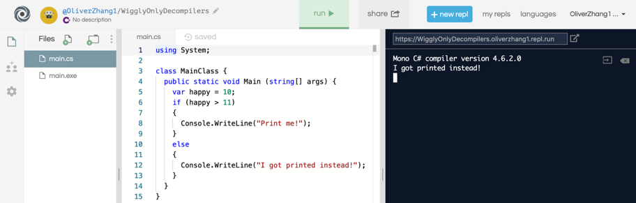

You can chain many cases together using `else if`. Note that when using `else if`, only the first case will be evaluated. For example, in the following code snippet, `Statement` 1 will be printed. We will skip the check that `sad == 4` and `Statement 2` will not be printed, even though `sad == 4` is `true`.

```csharp
var sad = 4;
if (sad < 9)
{
    Console.WriteLine("Statement 1");
}
else if (sad == 4)
{
    Console.WriteLine("Statement 2");
}
else
{
    Console.WriteLine("Statement 3");
}
```

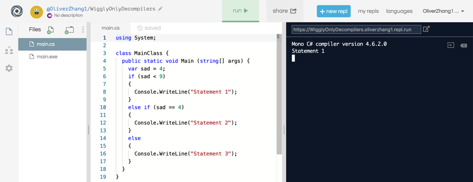

You can also place `if` statements inside other `if` statements for some interesting behavior:

```csharp
var num1 = 10;
var num2 = 20;
if (num1 < num2)
{
    if (num2 < 30)
    {
        Console.WriteLine("Hello!");
    }
    else
    {
        Console.WriteLine("Hola!");
    }
}
```

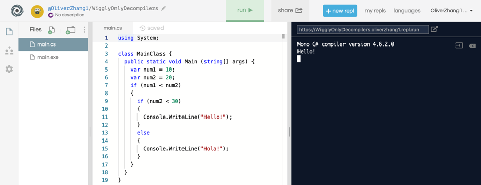

### Working Together
Let's write a program that first prints the following line to console:

```
Is coding fun?
```

Afterwards, the console waits for user input.

- If the user enters yes, the computer prints out `Yes, I'm glad you're enjoying it!`.
- If the user enters no, the computer prints out `Oh no, that's too bad!`.
- Otherwise, the computer prints out: `I don't understand you! Goodbye!`.

### Fun Fact: Switch statements
Using multiple `if`, `else` statements could get very long and confusing. You can use `switch` statements instead if you want to compare a single variable against multiple values. For example, the **Working Together** activity can be completed using the following piece of code:

```csharp
    var input = Console.ReadLine();
    switch (input)
    {
        case "yes":
            Console.WriteLine("Yes, I'm glad you're enjoying it!");
            break;
        case "no":
            Console.WriteLine("Oh no, that's too bad!");
            break;
        default:
            Console.WriteLine("I don't understand you! Goodbye!");
            break;
    }
```

Each case represents a possible value that the variable input might take. Make sure you use the `break` statement to tell the computer that you have completed all the actions associated with this case.

### Activity 5
This activity is split into two parts. Use your knowledge of `if`-`else` statements to complete the activities. As always, press **run** after completing each part to check for errors.

#### Activity 5.1
After the player guesses a letter, and we have checked whether the letter appears in the word, we need to check if the entire word has been guessed. If the entire word has been correctly identified, we should let the computer know that the player has won the game. Use an `if`-statement to change the value of the won variable only if the number of letters correctly guessed equals the number of letters in the word to guess.

#### Activity 5.2
At the end of the game, we should let the player know if they won or lost the game.
If the player has won the game, print out to console `You won!`.
Else, tell the player that they lost, and print out the correct answer. For example, if the player could not guess the correct answer `"Hello"`, print out `You lost! The answer was 'Hello'`.
To test both parts of the activity, set the word bank to only contain one two-letter word (see **Activity 2** if you forget how to do this). Press **run**, and correctly guess the word when playing the game. Make sure `You won!` is printed out. **Run** again, and check that `You lost! `is printed out when you lose the game.

## While loops
`while` loops are an easy way to repeat the execution of lines without having to reuse a line many times. For example, to print `Hello World` five times in a row, you can do:

```csharp
var counter = 1;
while (counter <= 5)
{
    Console.WriteLine("Hello World");
    counter = counter + 1;
}
```

Like an `if` statement, inside the `()` beside `while`, you should specify a boolean expression. If the expression is `true`, the code inside the curly braces `{ }` is executed. However, after everything inside the curly braces is executed, we go back to the top of the `while` loop and check the boolean expression again. If the boolean expression continues to be `true`, the loop will be repeated.

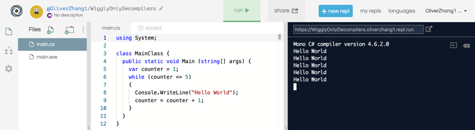

You can also place `if` statements in `while` loops to do some interesting behavior:

```csharp
var counter = 1;
while (counter <= 10)
{
    if (counter < 5)
    {
        Console.WriteLine("Smaller than 5!");
    }
    else
    {
        Console.WriteLine("Greater than or equal to 5!");
    }
    counter = counter + 1;
}
```

Here is an example of an infinite loop - do you see what's wrong? What can you do so that the following piece of code prints `Spam!` only 100 times?

```csharp
var counter = 100;
while (counter > 0)
{
    Console.WriteLine("Spam!");
}
```

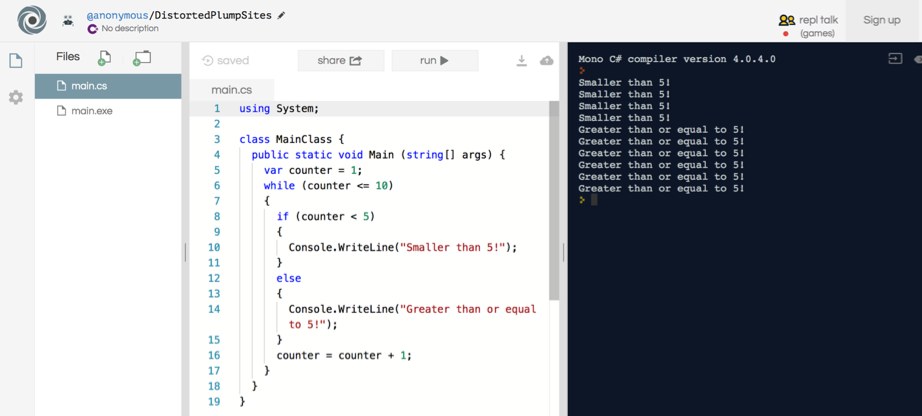

### Working Together
Take your code from the previous activity. Let's expand the code so that instead of the program finishing after the user inputs once, allow the user to answer the question 10 times before exiting. Be careful about infinite loops!

### Activity 6 - Completing the game!
Now, let's finally address the bug that was introduced in **Activity 4.2**. The game should continue to ask the player to guess letters if they have some lives remaining, and they have not yet won the game. Look at the `for` loop. As you might have noticed, even though you might have lives remaining, the game abruptly stops after only 3 guesses. We will replace this `for`-loop with a `while`-loop, with the correct looping condition. Use the given hint to complete the activity.
