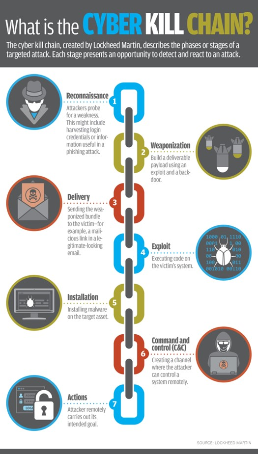

# Introduction: Learn Kusto Query Language (KQL) to catch the hacker!

## Welcome new Cyber Defenders! 
*---Threat intel is for everyone*
Learn Cybersecurity using real threat data.
**KC7 is a game that teaches you real world cybersecurity skills**
>KC7 simulates an intrusion by multiple cyber threat actors against a fictitious company that teaches you to identify adversary activity across all seven phases of the Cyber Kill Chain using realistic data.
<!---->
<!---->

By the end of your first day on the job, you should be able to: 
 
 Use Azure Data Explorer (web version)   
 Use multiple data sets to answer targeted questions  
 Find cyber activity in logs including: email, web traffic, and server logs  
 Use multiple techniques to track the activity of APTs (Advanced Persistent Threats)  
 Use third party data sets to discover things about your attackers   
 Build a threat intelligence report    
 Make recommendations on what actions a company can take to protect themselves    

If you are a trainer please start with the next block **T3: Know Your Why**. If you are a student please skip ahead to **Tutorial 1: Azure Data Explorer (ADX) Basics**

{}
Please do not use the Firefox browser for this workshop.
{}

Table of Contents

{}

