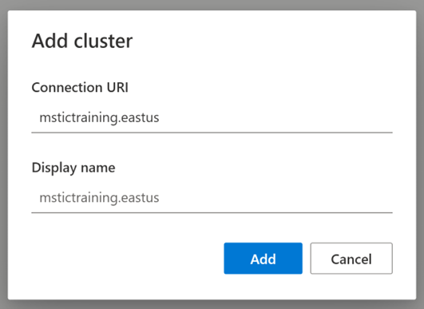
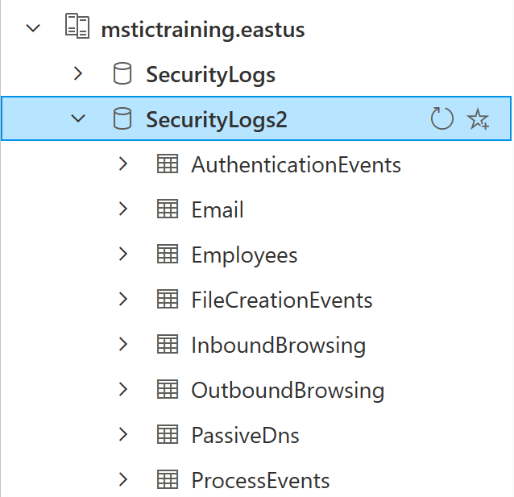



# Section 1: The Walkthrough!

## Getting Set Up in Azure Data Explorer (ADX)

ADX is a tool used by cybersecurity experts for data exploration and data analysis. The 
great thing about ADX is that it is used by cyber analysts at many of the smallest and largest 
organizations in the world. 

Let’s get you logged in and started with ADX:
1. Go to https://dataexplorer.azure.com/ and login with your @microsoft.com account credentials. 
2. Click the Query tab on the left side of the screen.

Data in ADX is organized in a hierarchical structure which consists of **clusters, databases, 
and tables**. Security logs are stored in a single cluster. You’ll need to 
add this cluster to your ADX interface so you can start looking at the log data. 

3.	Add a new cluster using the cluster URI provided by your instructor 
•	Click add cluster 
•	Enter Connection URI: mstictraining.eastus 

4.	Select your database 
•	Expand the dropdown arrow next to your cluster. You should then see one database, called **SecurityLogs** inside it.  
•	Expend the dropdown arrow next to the **SecurityLogs** database.  
•	Click on the **SecurityLogs** database. Once you’ve done this, you should see the database highlighted- this means you’ve selected the database and are ready to query the tables inside. 

The big blank space to the right of your cluster list is the query workspace. That’s where you’ll actually write the queries used to interact with our log data.  

If your browser looks like the image above (i.e. you can see the SecurityLogs database), you're good to go!
