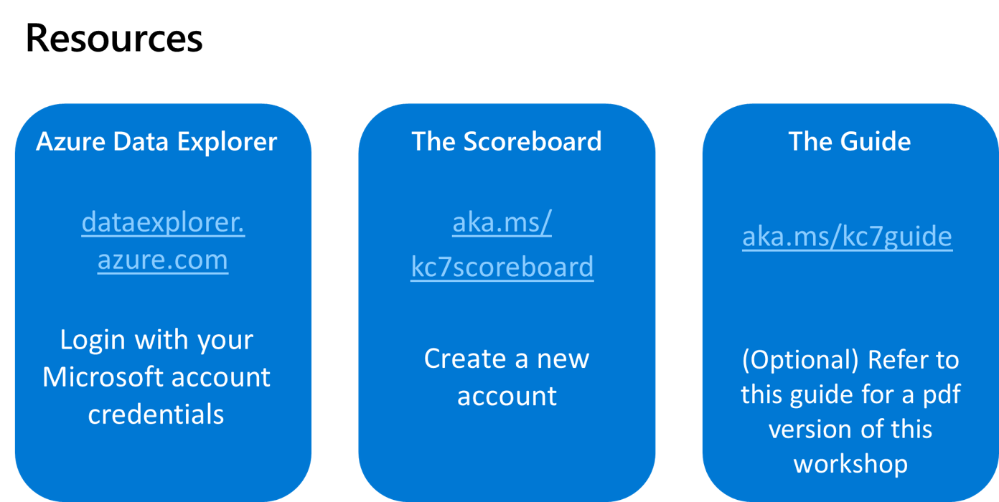

# How It Works
<!---->

# Eample Scenario

# Choosing the right event for you

### Audiences
There are several audiences that can benefit from playing KC7.  You should first identify your intended audience, then you will want to adjust how you configure the game to make sure they get the most out of it 
| Audience  | Goal  | Needs/Benefits |
|------ | ------ | ------------------------- |
| Middle and High School Students | Get excited | No experience with cybersecurity. You can use KC7 to give them excited about cybersecurity and get them exposure to the field. The focus is on making sure they have fun and maybe learn something new. |
| College Students | Get excited / Prep for internships | Whether or they have any cybersecurity experience, you can use KC7 to give them practical exposure to the field. Those who interest/promise can keep playing KC7 to get hand-on experience that will set them up for success when applying for internships/jobs. |
| Transitioning professionals | Get job-ready skills | KC7 provides practical blue-team cybersecurity traininig beyond memorizing acronyms. For transitional professionals, this give them a safe-space to get exposure to many foundational cybersecurity principals and to begin building their analysis skills.  |
| Industry Security professions | Sharpen analytical skills | SOC analysts and Incident responders can use KC7 to improve their pivoting and analysis skils. They can use this game to sharpen their intuition when it comes to threat hunting and "knowing where to looks next." They can learn how to understand end-to-end adversary attack paths. |
|Threat Intel Professionals | Learn how to do primary-source threat intel | Learn how to cluster threat activity based on known indicators and TTPs. Threat intel analysts can learn how to attribute activity to clusters using models such as the Diamond Model and Cyber Kill Chain. They can also become familiar with common attribution pitfalls and figure out how to avoid them. |