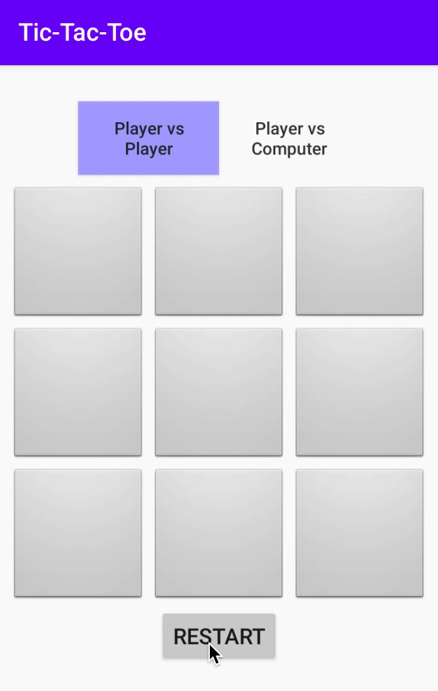

## Start your Android Game Adventure

Have you ever wonder how you could build your own Tic-Tac-Toe?

You in luck, today is the day, you will get to build your own!

## Getting Started

## What is Android?

Android is currently the most used mobile operating system in the world! Android Studio lets you create apps that can be used by these Android devices. In fact, if you have an Android phone, then you can even download the app you're making today onto your phone!

## About this Project

In this project we've given you a mostly working Android application that's a game of Tic-Tac-Toe. It needs your help to fix some problems and add a few parts to make it a great game!

## Download the Project Files
To get started, download the project files using the steps below:
1. [Download the project files](../resources/_gen/files/TicTacToe.zip) for your game.
2. Find the TicTacToe.zip file in your downloads folder.
3. Unzip the file.
   - On Windows: Right-click on TicTacToe.zip and select `Extract All...`. A folder named 'TicTacToe' will be created containing the project code.

On this adventure, you will need to solve the puzzles marked with `PUZZLE` tags to complete the game!

## Table of Contents

Table of Contents

{}

