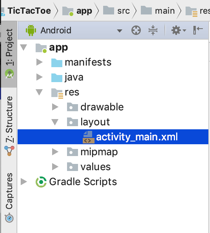
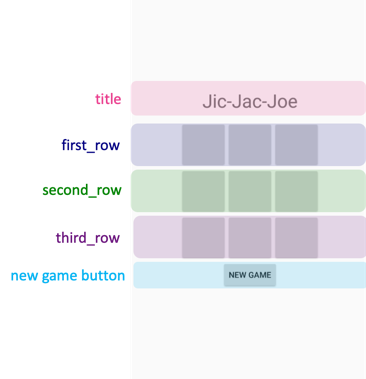
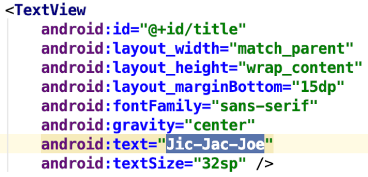
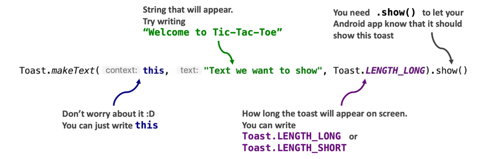
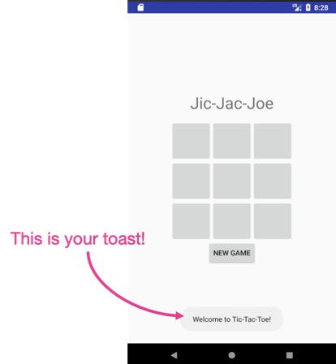
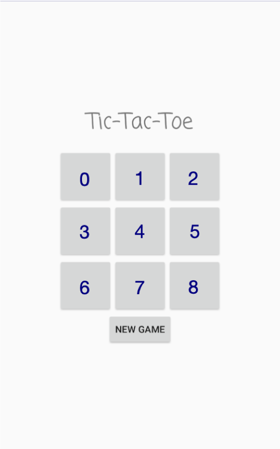

# Tic-Tac-Toe

## An introduction to Android programming


## Getting Started with Android Studio

Android is currently the most used mobile operating system in the world! Android Studio lets you create apps that can be used by these Android devices. (In fact, if you have an Android phone then you can even download the app you’re making today onto your phone!)

1. To make a new app...
2. Now, let's get started.
3. Do not delete any of this code! Only delete code when we tell you to, so that we don't accidentally break the app.

### Activity 1

Press the play button button (►) at the top of Android Studio and you’ll see that the title at the top of the app says Jic-Jac-Joe (which is totally wrong) so let’s change it to Tic-Tac-Toe.



Use the project window on the left to find **activity_main.xml** (and double-click it to open it). On the bottom of the screen, you will see a Design and Text button. Click Text.

1. Let's take a closer look at the pre-existing code in this file and understand what it means. The LinearLayout at the top of the file tells your application that all of the buttons and textboxes will appear in a (vertical) line. The picture below can better help you visualize how the buttons in your app are all in a line:



2. Look for the title TextView. Delete `"Jic-Jac-Joe"` and write `“Tic-Tac-Toe”` instead. Now press the play button (►) and your app should now say Tic-Tac-Toe at the top.
    - Note, you can also do this change by going to the Design page (instead of the Text page that you’re now looking at), clicking the title, and editing the words in the text field.
3. Try changing the `fontFamily` field from `“sans-serif”` to `“casual”`, `“cursive”`, `“sans-serif-smallcaps”`, or `“serif”` (or other fonts you might like). You can then ress the play button (►) to see your changes in your app.
   - You can also preview your changes without the play button by going to the Design tab of the activity_main.xml file.
4. Change the color of your title! Use the color wheel below to help you pick a color then add the color by adding a line in your TextView like this: `android:textColor="#55E5E4"` (this is for the Nuevo blue color).
   - If you want another color then google #55E5E4

Before going to the next section, observe that the buttons in **activity_main.xml** have this `android:onClick="makeMove"` which tells your app to run `makeMove` which is a function in **MainActivity.java**. Learn more about this function in the glossary below!

# The Basics

## Printing

`System.out.println` means to tell the computer to print the sentence enclosed within the parentheses () out onto the console. To try it out, press run. You see that `Hello World` is printed out to the screen on the right.

### Working Together

1. Without removing the quotation marks, try changing `"Hello World"` to another sentence. Press run to see if anything changes.
2. Add another `System.out.println` below the current line to print a second sentence below the first sentence.
3. Press run to see if two sentences are printed out. If you see any red text, please ask for help.

`System.out.println`; is helpful when you want to fix bugs in code, but your user (the person using the app) can’t see text printed with this function. But we can do this with toasts! A toast is a quick, small text that we make visible to the user. Here’s how to make a toast:


### Activity 2

Let's add a welcome message that the user can see when they start your app!

Go to **MainActivity.java** and find `// TODO (ACTIVITY 2)` in the code and write a toast (like in the picture above) that welcomes the user to your game with "Welcome to Tic-Tac-Toe!”. Now press the play button (►) at the top of Android Studio and your app should look like this:



**HELP! I got a lot of red text!**

If you see any red text, you have encountered some errors! Please ask for help or check the debugging page at the end of this tutorial. Beware of the following when coding in Java:

1. The `t` in `Toast` is capitalized.
2. There is a semicolon `;` at the end of the line.
3. Make sure the sentence you wish to show is surrounded in quotation marks, and that the parantheses are in the right place.
4. Do not delete any curly braces `{` or `}`.

## Comments

Developers often need to collaborate with other developers. Comments are an easy way for developers to write notes in the code and communicate with others. Comments are ignored by the computer; thus, they are also an easy way to tell the computer to not run certain lines of code. There are two ways to create comments:

1. To comment out one line, place `//` in front of a line of code. For example:

```java
// This is a single-line comment.
```

2. To comment out multiple lines at once, indicate the start of the comment with `/*` and the end of the comment with `*/`. For example:

```java
/* This is a multi-line comment.
This line is also part of the comment. */
```

To remove a comment (or uncomment a line), simply delete the `//` for a single-line comment, or the `/*` and the `*/` characters for the multi-line comment.

### Working Together

1. Type `//` in front of `Toast.makeText(this, "Welcome to Tic-Tac-Toe”, Toast.LENGTH_LONG);`. After pressing the play button (►), check to make sure that `Welcome to Tic-Tac-Toe` does not show up on the screen.
2. Delete the `//` and instead, surround `Toast.makeText(this, "Welcome to Tic-Tac-Toe”, Toast.LENGTH_LONG);` with `/*` and `*/`. Check that `Welcome to Tic-Tac-Toe` is still not printed to the console after pressing the play button (►).
3. Delete both `/*` and `*/`, and press the play button (►). Welcome to Tic-Tac-Toe should now be printed to the console.
   Throughout today's activity you will see various multi-line comments and `// TODO` comments (like the one for Activity 2). These comments will guide us towards completing the Tic-Tac-Toe game, so be sure you understand how to comment and uncomment code.

## Strings

Anything that is surrounded in quotation marks is called a string. This is how a computer represents words or sentences. For example, `"a"`, `"2"`, `"banana!"`, and `"Hello World"` are strings, but `Hello World` and `2` are not strings, because the quotation marks are missing. You can combine many strings together using the + operator. For example:

- `"Apple" + "Pineapple"` produces the string `"ApplePineapple"`.
- `"Nuevo" + " " + "Foundation"` produces the string `"Nuevo Foundation"`.

### Working Together

Delete all your `System.out.println` text in your code. Start your code with the line `System.out.println("Nuevo" + " " + "Foundation");`. Note that there are many ways to combine strings together. For example, another way to print Nuevo Foundation would be to write `System.out.println("Nue" + "vo Fou" + "ndation");`. We will brainstorm at least one more way to print the string `"Nuevo Foundation"` using two `+` symbols in each `System.out.println` statement. Verify that Nuevo Foundation is printed out 3 times. In other words, your console should look like this after you press run:

        Nuevo Foundation
        Nuevo Foundation
        Nuevo Foundation

## Numbers

The computer can also do regular math that you see in school. Use `System.out.println` to print out the result from the math expressions.

```java
System.out.println(5 + 4);
System.out.println(6 * (9 - 7) / 3);
```

Here is the full list of math symbols that you can use:

<table class="table">
            <tr>
                <td><code class="language-cs">+</code></td>
                <td>Add</td>
                <td><code class="language-cs">\</code></td>
                <td>Divide</td>
            </tr>
            <tr>
                <td><code class="language-cs">-</code></td>
                <td>Subtract</td>
                <td><code class="language-cs">%</code></td>
                <td>Modulo (remainder)</td>
            </tr>
            <tr>
                <td><code class="language-cs">*</code></td>
                <td>Multiply</td>
                <td><code class="language-cs">(</code>,<code class="language-cs">)</code></td>
                <td>Parenthesis</td>
            </tr>
        </table>

**_Fun Fact: Computer Division_**

The computer does division differently from your regular calculator. Computer division will exclude remainders or decimals. For example, 15 / 4 produces 3, and not 3.75.

### Working Together

Try printing out the answers to the following to the console. Ensure your brackets are matched. Use a calculator (or mental math) to verify the computer produced the correct answer.

- 2 - 19
- (3 + 5) \* 6
- (13 + 5 \* 8) / (6 - (3 + 7))
- 3 % 2

Add more lines to the code below to find out whose turn it will be on the 4th, 5th, and 6th turn. Before coding, guess whose turn you think it will be! TIP: You can just copy and paste the `System.out.println` calls below and change the number.

<!-- <iframe height="400px" width="100%" src="https://repl.it/@nuevofoundation/VerticalWateryText?lite=true" scrolling="no" frameborder="no" allowtransparency="true" allowfullscreen="true" sandbox="allow-forms allow-pointer-lock allow-popups allow-same-origin allow-scripts allow-modals"></iframe> -->

## Booleans

Booleans are true or false statements. Unlike strings or numbers, booleans store statements of truth: is what I am saying true or false? For example, if I ask, "Are you a robot?", this question produces a true or false result, which we call a Boolean. In this case, since you are not a robot (hopefully!), we would produce false. We can also use math operators to create boolean expressions. Here are some examples; however, notice the unusual symbols for "equal to" and "not equal to":
< Less than > Greater than
<= Less than or equal to => Greater than or equal to
== Equal to != Not euqal to
As usual, use `System.out.println` to print out your results:

```java
System.out.println(10 < 8);
System.out.println((3 * 6) == (32 - 14));
```

### Working Together

Delete all your `System.out.println` text in your code. Try guessing the answers to the following expressions. Use `System.out.println` to check your answers.

- 54 < (10 + 32)
- (37 / 5) == 7
- "Hello" + "World" == "Hello World"
- false == false

## Booleans Operators

You can also connect boolean expressions together using the `&&` (AND) and the `||` (OR) operator. For example, suppose I ask: "Are you a human, and is Nuvi a robot?" The word "and" connects the two true-false questions together. In this case, since it is true that you are a human, and it is also true that Nuvi is a robot, then the overall result is `true`. Here's a chart that describes what happens when we connect booleans together:
Expression | Result | Expression | Result
--- | --- | --- | ---
`true && true` | `true` | `true || true` | `true`
`true && false` | `false` | `true || false` | `true`
`false && true` | `false` | `false || true` | `true`
`false && false` | `false` | `false || false` | `false`

To summarize, `&&` requires both Boolean expressions to be true, while `||` only requires one of the two Boolean expressions to be true. Here are some more examples:

- `(5 < 8) && (9 != 10)` produces `true` since both 5 is less than 8 and 9 is not equal to 10.
- `(6 != 2 * 3) || (8 < 2 * 4)` produces `false` since both 6 not equal to 2 _ 3, and 8 not being less than 2 _ 4, produce `false`.

**MAKE A NOTE ABOUT ISGAMEOVER**

## Variables

Variables are simply names that we can give to values such as strings, numbers, and booleans. We use variables to store information so the computer can keep track of it. Variables are created by using the type of the variable and the name of the variable. Then you can assign that variable to the information that you want to store by using `=` and the content.

Look at the variables at the top of of **MainActivity.java**.

```java
String[] board = new String[9];
int currentTurn = 0;
boolean gameOver = false;
```

- `board` is an array of strings that holds the values of the cells in the Tic-Tac-Toe game (since there are 9 cells/boxes in the game). See how the cells are numbered below (and notice that we start counting with the number zero). 
- `currentTurn` keeps track of the turn we are on currently (so that's why it was an int/integer/number)
- `gameover` keeps track of whether the game is over or not (so that's why it's only true or false)

### Activity 3

This activity will test your knowledge about variables. At the end of the game, we should make the app say who won. For example, if the player with X wins, we should show `X won!` (and if O wins then we should show `O won!`). We already store the current player as a string in the makeMove function in **MainActivity.java** so use it to complete this activity.

Find `TODO: (Activity 3)` in the **MainActivity.java** and write a string below it (name it victory) that says which player won. Then make a toast that shows this string in the next line.

## Conditionals

We can use if statements to run a code statement only if certain conditions are met.

For example:

```java
if (isRainingOutside == true) {
    takeUmbrella = true;
} else {
    takeUmbrella = false;
}
```

For our game we should add an **`if` statement** to make sure our bird is still on the screen. In the original game, you can't touch the ground or the top of the screen or the game ends.

Inside the `()` beside `if`, you should specify a _Boolean expression_. **Booleans** are `true` or `false` statements. We can utilize this in our if statement. If the expression is `true`, the code inside `{ }` is executed.

You can also connect **Boolean expressions** together using the `&&` (AND) and the `||` (OR) operator.
