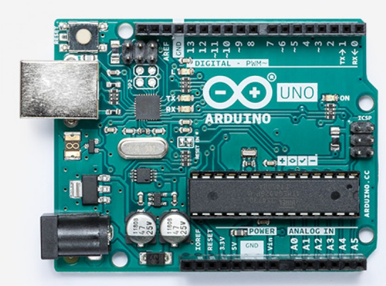

## Introduction - Building with Arduino

Electronics like microcontrollers, sensors, and all types of circuitry are all around us! Some are very basic and provide telemetry information for traffic systems. Others run the traffic lights programmed with built-in timing.

Today we will work on a few activities to show you some of the capabilities of this platform. We will start small and simple and build to bigger and more complex. You will learn all the basic information about how to use the Arduino controller board, sensors, and components. After you do each activity, feel free to change some things to see what is different and gain a deeper understanding.

## Table of Contents

Sections

{}

