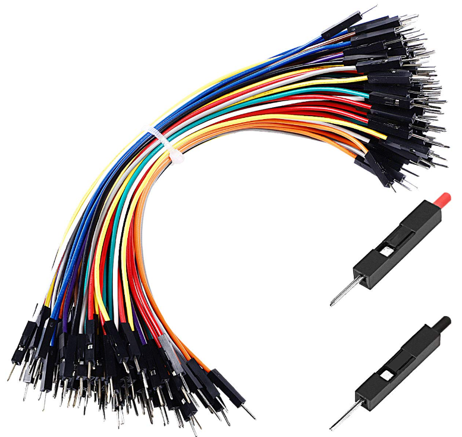

## Introduction - Building with Arduino

Electronics like microcontrollers, sensors, and all types of circuitry are all around us! Some are very basic and provide telemetry information for traffic systems. Others run the traffic lights programmed with built-in timing.

Today we will work on a few activities to show you some of the capabilities of this platform. We will start small and simple and build to bigger and more complex. You will learn all the basic information about how to use the Arduino controller board, sensors, and components. After you do each activity, feel free to change some things to see what is different and gain a deeper understanding.

## The Components

 The components we will use for the project are shown below. Make sure you have all these components before starting:

`Elegoo` UNO Project Super Starter Kit with Tutorial for Arduino includes all hardware (with exception to the computer)

* Core components needed for all activities
  * Arduino UNO R3
  * USB A to B cable
  * Windows 10 PC
  * Arduino IDE software (download)

* Additional components needed for specific activities
  * (5) LEDs (any color)

  * (5) [220ohm resistor](https://somanytech.com/220-ohm-resistor-color-code)

  * Jumper wires

  * Female-to-male jumper wire

  * LCD panel + 5K ohm resistor
  * 9V Battery (optional)

## Table of Contents

Table of Contents

{}

