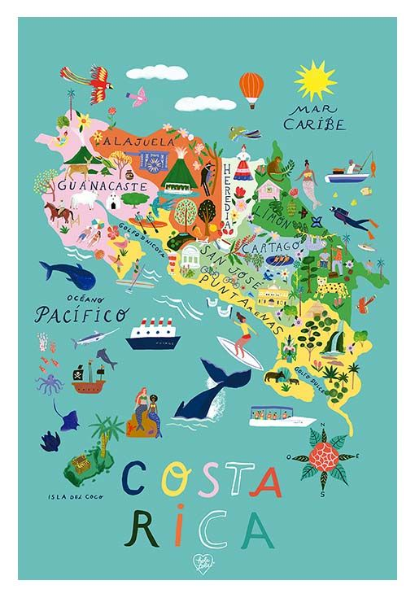
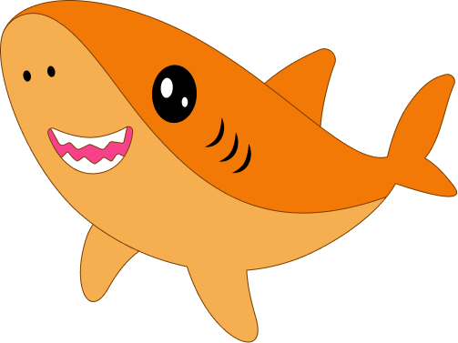

## Introduction

Welcome! You just won a tour to Costa Rica.

Below you will see a map of Costa Rica with the most important things about this beautiful country

On this learning adventure, Sharky will be helping you. Sharky is a very unusual shark that appeared in the waters of Costa Rica, discovered by some fishermen!

Can you believe it? An orange-colored shark!

## Contents

Sections

{}

