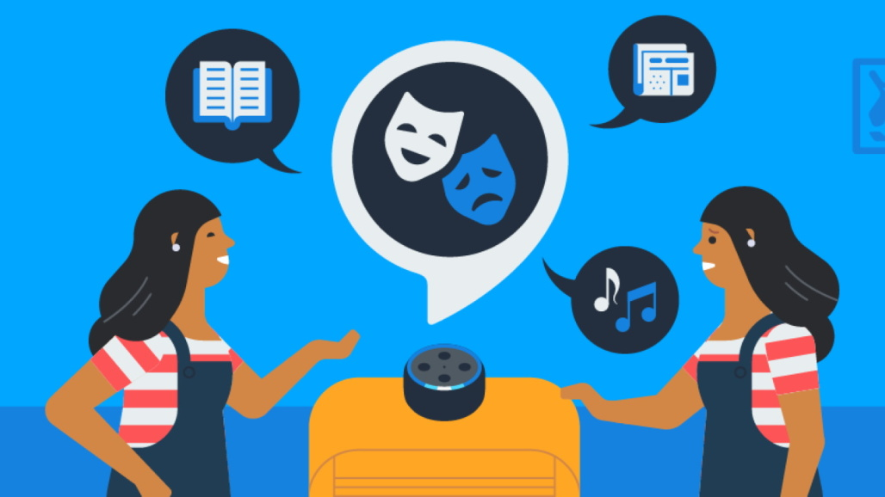

## Introduction
In this workshop, you will learn how to create your own chatbot. By the end of the workshop, you will have a chatbot that can have a simple conversation with the user. You will learn how to use AIML, a language for creating chatbots. You will also learn how to use Pandorabots, a platform for hosting chatbots.

## What is a chatbot?
A chatbot is a computer program that simulates human conversation to answer questions. 

## Examples of chatbots
Chances are you've already interacted with a chatbot as part of your daily life. 

You might use a virtual assistant to set a reminder on your phone, or to play a song on your smart speaker.

You might have interacted with a chatbot to get help with a product or service.

More recently, chatbots have become more well-known thanks to technologies like ChatGPT.

## History of chatbots
Chatbots have been around for a long time. The first chatbot was created in 1966 and was called ELIZA. In 1995, a new chatbot called ALICE was created. ALICE was written using AIML, which is the same language we will learn in this workshop.