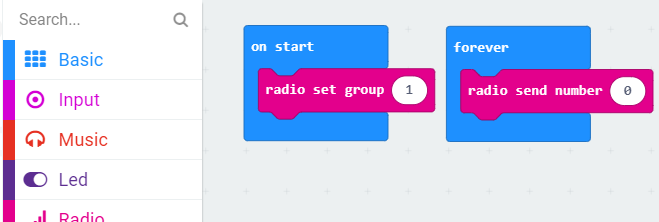
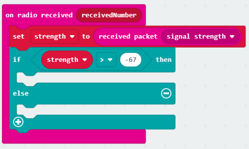

<!--
  TODO:
    * Introduction
    * Hardware setup
    * Pairing device and downloading code
    * Using the MakeCode simulator
-->
---
title: "micro:bit — Wireless Social Distancing"
description: "A guide to keeping at least 2 m apart with "
date: 2020-07-297T08:45:08-07:00
prereq: "None"
difficulty: "Beginner"
download: ""
draft: true
icon: "fas fa-microchip"
weight: 1
translationKey: "microbit-distancing"
---

### Turning On the Radio
Today we'll be using the Bluetooth radio on your microbit to figure out how far away you are from other microbits. The first thing we need to do is turn on the radio and tune it to a channel. Click on the section that says Radio. It's the pink section fifth from the top. Choose "radio set group 1️⃣" and drag it into the blue "on start" block in the workspace. Make sure that you use the same group number as everyone else. If you use different group numbers, your microbits won't be able to talk to each other.

### Broadcasting a Signal
Now that our microbits are set up to listen, we need to send out a signal for them to pick up. Click on the Radio section again. This time drag the "radio send number 0️⃣" block into the blue "forever" block in your workspace. This will make your microbit continuously send that number to any device listening in the same group.

### Receiving a Message
Now that we're sending messages and listening for them, we need to use that information to find out how close together or far apart our microbits are. To do that, we need to know how strong the signal we're receiving is. Go back into the Radio section and this time drag the "on radio received (receivedNumber)" block and drag it to an empty spot on your workspace. It should not be inside of any other block.

This block tells our microbit to do something whenever it gets a number sent to it from another microbit.

Next, click on the red Variables section then click on "Make a Variable...". In the text box, type in "strength" as the name for your new variable, then click "Ok ✔".

Now, go back to the Variables menu and drag "set strength to 0️⃣" inside of the pink "on radio received (receivedNumber)" block. Then go back to the Radio menu and drag "received packet (signal strength)" on top of the 0️⃣ in "set strength to 0️⃣". When you're done, your workspace should look something like this:

### Interpreting Signal Strength
Now that our microbit knows how strong the signal it got is, we need to use that to figure out how close we are. Click on the Logic section and grab the "if true then / else" block. Drag that inside the radio received block, just under where we set the strength variable. Go back into the Logic section and drag the 0 = 0 comparison on top of the true on the "if true then" line. You code should now look like this:

Next, we'll tell our microbit computer how to tell whether we're 6 feet (2 meters) apart. Open the variables menu and select the bubble that just says "strength" and drag that on top of the first zero in our if block so it says `if strength = 0 then`. Now, click on the equal (=) sign to make a list of different symbols appear. Choose the greater than (>) symbol. Lastly, click on the last zero in our if statement and replace it with `-67`. Your pink "on radio received" block should now look like this:

You might be wondering: "Why -67? That seems like a random number." -67 just happens to be the signal strength we already measured ahead of time when two microbits are 6 feet apart. Different Bluetooth radios, like the one in your phone, might have a different strength at the same distance. The closer your signal is to 0, the stronger it is and the closer you are to the other radio. A signal strength farther from 0 is weaker, meaning you're probably also farther from the radio.

That means if the signal we get is stronger than -67 (`strength > -67`), our microbit radios are less than 6 feet away from each other. But if the signal is weaker than that, our radios must be more than 6 feet apart.

### Lighting It Up
We have all our logic written, but no way to tell if we're more than 6 feet apart. Now we'll add some lights so we can see when we're far enough apart. Click the Basic section at the top and drag a "show icon" block into the if part of our logic block. Click on the icon to see a list of other icons and choose the sad, frowning face. Go back to the Basic menu, grab another "show icon" block, and place it in the else part of the logic block. Change the icon to a smiling face. When you're done, your code will look like this:

