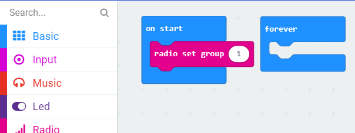

## Turning On the Radio
Today we'll be using the Bluetooth radio on your micro:bit to figure out how far away you are from other micro:bits. The first thing we need to do is turn on the radio and tune it to a channel. Click on the section that says Radio. It's the pink section which is fifth from the top. Choose "radio set group 1" and drag it into the blue "on start" block in the workspace. Make sure that you use the same group number as everyone else. If you use different group numbers, your micro:bits won't be able to talk to each other. Your workspace should look like the below after you are done:

## Broadcasting a Signal
Now that our micro:bits are set up to listen, we need to send out a signal for them to pick up. Click on the Radio section again. This time drag the "radio send number 0" block into the blue "forever" block in your workspace. This will make your micro:bit continuously send that number to any device listening in the same group.

