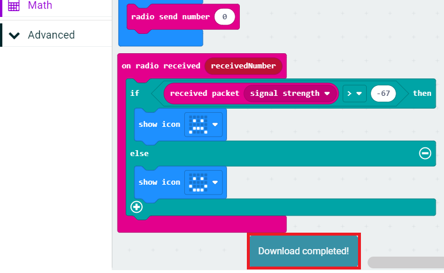

## Downloading the code and trying it out
Now that our code has been written, it's time to try it all out. First, we have to pair the micro:bit with a computer. Find your USB cable and connect the smaller side to the silver USB port on the top of your micro:bit. Connect the other, larger end to a USB port on your computer. On the MakeCode workspace, click the ellipsis (...) next to the Download button to make a small menu pop up. From that menu, click on "Pair device".

In the new window that pops up, click the purple "Pair device" button in the bottom-right corner. Finally, another window will pop up. Click on "BBC micro:bit CMSIS-DAP" and then on the Connect button at the bottom. Now we're connected and ready to download the code. You should only need to pair once.

Now click the ellipsis (...) next to the purple Download button again. This time, click the "Download to micro:bit" option. When the Download button is done spinning, look for the "Download complete" bubble: that means we're done! Try moving away from other micro:bits on the same radio channel to see that frown on the micro:bit turn into a smile!

## That's it!
Congratulations! You've just written code to make two pieces of hardware talk to each other _wirelessly_ AND check distance. Well done! 👏🏽👏🏽👏🏽
