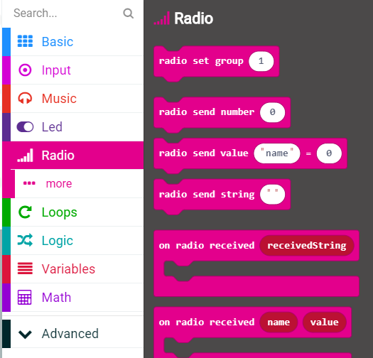
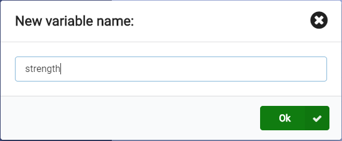
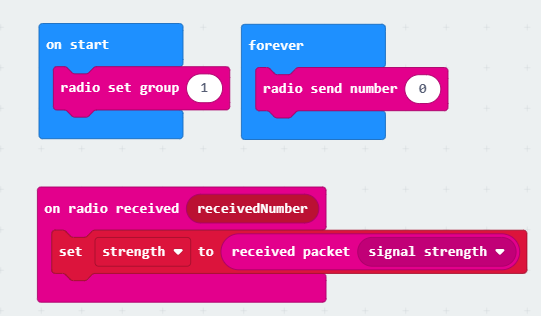
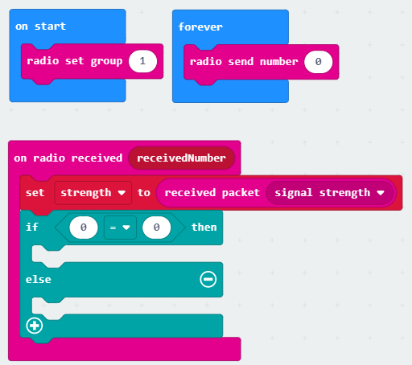
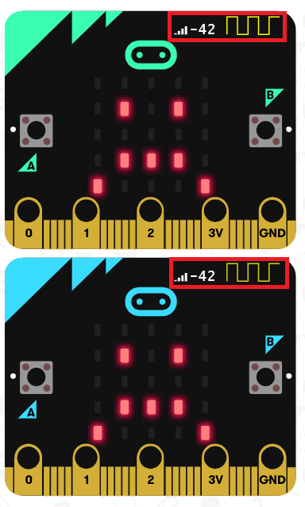

## micro:bit - Wireless Social Distancing
In this workshop, we'll be using the wireless Bluetooth radio on a micro:bit to determine how far apart two or more people are. Your micro:bit will show a frowning face until it's at least 6 feet away from other micro:bits, then it smiles.

### What is a micro:bit?

A micro:bit is a programmable mini computer! It can be coded from any web browser in various languages like javaScript, Python, Scratch, and Blocks. For our session today with we will be using MakeCode blocks.

Your micro:bit has the following physical features:

- 25 individually-programmable LEDs
- 2 programmable buttons
- Physical connection pins
- Motion sensors (accelerometer and compass)
- Wireless communication via bluetooth radio
- USB interface

If you want to learn more about each individual component and all the features that come with your micro:bit, you can click [here](https://micro:bit.org/guide/features/).

Go ahead and take out the the micro:bit and the rest of the components from the bag. You should have one micro:bit, 2 batteries, a micro USB cable, and the battery holder (the black box with the red and black wires coming out of it). If you're missing anything or need help feel free to ask one of the instructors!

### Turning On the Radio
Today we'll be using the Bluetooth radio on your micro:bit to figure out how far away you are from other micro:bits. The first thing we need to do is turn on the radio and tune it to a channel. Click on the section that says Radio. It's the pink section which is fifth from the top. Choose "radio set group 1" and drag it into the blue "on start" block in the workspace. Make sure that you use the same group number as everyone else. If you use different group numbers, your micro:bits won't be able to talk to each other. Your workspace should look like the below after you are done:

### Broadcasting a Signal
Now that our micro:bits are set up to listen, we need to send out a signal for them to pick up. Click on the Radio section again. This time drag the "radio send number 0" block into the blue "forever" block in your workspace. This will make your micro:bit continuously send that number to any device listening in the same group.

### Receiving a Message
Now that we're sending messages and listening for them, we need to use that information to find out how close together or far apart our micro:bits are. To do that, we need to know how strong the signal we're receiving is. Go back into the Radio section and this time drag the "on radio received (receivedNumber)" block and drag it to an empty spot on your workspace. It should not be inside of any other block.

This block tells our micro:bit to do something whenever it gets a number sent to it from another micro:bit.

Next, click on the red Variables section then click on "Make a Variable...". In the text box, type in "strength" as the name for your new variable, then click "Ok ✔".

Now, go back to the Variables menu and drag "set strength to 0" inside of the pink "on radio received (receivedNumber)" block. Then go back to the Radio menu and drag "received packet (signal strength)" on top of the `0️` in "set strength to 0️". When you're done, your workspace should look something like this:

Variables are simply places we can store information with a friendly name to make it clear what's stored inside. So, by creating a variable called `strength`, what we're doing is setting aside some space to store a value, in this case the measured signal strength from the message we received. We can then simply use the name `strength` anywhere we want to check the current value inside or compare it against something else. If we get a new message later with a stronger or weaker signal, the value of `strength` gets updated to that new value automatically. Hence the "on radio received" block: every time we get a new message, the value of `strength` is updated to the latest signal strength without you having to anything manually.

### Interpreting Signal Strength
Now that our micro:bit knows how strong the signal it got is, we need to use that to figure out how close we are. Click on the Logic section and grab the "if true then / else" block. Drag that inside the radio received block, just under where we set the strength variable. Go back into the Logic section and drag the 0 = 0 comparison on top of the true on the "if true then" line. You code should now look like this:

Next, we'll tell our micro:bit computer how to tell whether we're 6 feet (2 meters) apart. Open the variables menu and select the bubble that just says "strength" and drag that on top of the first zero in our if block so it says `if strength = 0 then`. Now, click on the equal (=) sign to make a list of different symbols appear. Choose the greater than (>) symbol. Lastly, click on the last zero in our if statement and replace it with `-67`. Your pink "on radio received" block should now look like this:

You might be wondering: "Why -67? That seems like a random number." -67 just happens to be the signal strength we already measured ahead of time when two micro:bits are 6 feet apart. Different Bluetooth radios, like the one in your phone, might have a different strength at the same distance. The closer your signal is to 0, the stronger it is and the closer you are to the other radio. A signal strength farther from 0 is weaker, meaning you're probably also farther from the radio.

That means if the signal we get is stronger than -67 dBm (`strength > -67`), our micro:bit radios are less than 6 feet away from each other. But if the signal is weaker than that, our radios must be more than 6 feet apart.

### Lighting It Up
We have all our logic written, but no way to tell if we're more than 6 feet apart. Now we'll add some lights so we can see when we're far enough apart. Click the Basic section at the top and drag a "show icon" block into the if part of our logic block. Click on the icon to see a list of other icons and choose the sad, frowning face. Go back to the Basic menu, grab another "show icon" block, and place it in the else part of the logic block. Change the icon to a smiling face. When you're done, your code will look like this:

### Downloading the Code and Trying It Out
Now that our code has been written, it's time to try it all out. First, we have to pair the micro:bit with a computer. Find your USB cable and connect the smaller side to the silver USB port on the top of your micro:bit. Connect the other, larger end to a USB port on your computer. On the MakeCode workspace, click the ellipsis (...) next to the Download button to make a small menu pop up. From that menu, click on "Pair device".

In the new window that pops up, click the purple "Pair device" button in the bottom-right corner. Finally, another window will pop up. Click on "BBC micro:bit CMSIS-DAP" and then on the Connect button at the bottom. Now we're connected and ready to download the code. You should only need to pair once.

Now click the ellipsis (...) next to the purple Download button again. This time, click the "Download to micro:bit" option. When the Download button is done spinning, look for the "Download complete" bubble: that means we're done! Try moving away from other micro:bits on the same radio channel to see that frown on the micro:bit turn into a smile!

### Using the Simulator
While not as fun as having the actual, physical hardware, you can also use the simulator to see your code working. Look for the images of micro:bits off on the left side of your screen. If you don't see them, look for the ">" symbol on the left and click it to unhide the simulator. On the simulated micro:bits, find the Bluetooth radio antenna. It looks like a yellow square wave:

If you hover your mouse cursor over this wave-shaped antenna, the actual signal strength will show up next to it. You can then click on the antenna and drag your mouse cursor left to decrease the signal strength or right to increase it. If you get the signal strong enough (`strength > -67`), the other micro:bit will update to show a frowning face. Weaken the signal again to make the micro:bit smile.

### That's It!
Congratulations! You've just written code to make two pieces of hardware talk to each other _wirelessly_ AND check distance. Well done!