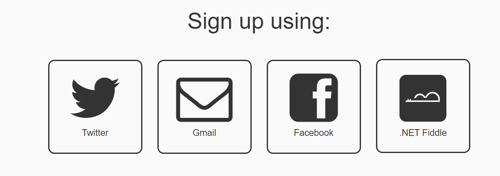

## Welcome

The goal of today's activity is to learn C# skills and incorporate your new-found knowledge to create a Guess The Word game!

## Starting Up

The goal of today's activity is to learn C# skills and incorporate your new-found knowledge to create a Guess The Word game! Let's get the game set up.

Today you will be using .NET Fiddle. 

{}
Before starting, you can choose to sign up for a .NET Fiddle account, if you do not yet have one, and would like to save your work later.

Click the button below to sign up for a .NET Fiddle account - you will need an email account in order to sign up. If you already have a .NET Fiddle account, you can login to your account using the below button as well.

<a class="my-2 mx-4 btn btn-info" href="https://dotnetfiddle.net/SignUp" target="_blank">Sign up for .NET Fiddle</a>

{}

Next, launch the .NET Fiddle console we will use today by clicking the below button. You should see the screen below.

<a class="my-2 mx-4 btn btn-info" href="https://dotnetfiddle.net/lMl7j4" target="_blank">Launch .Net Fiddle</a>

{}
If you logged in, you could fork the Fiddle, which simply means to make a copy of the program, so that we can make our own changes to it and save it. Click on the "Fork" button on the top.

After forking the Fiddle, you will see a window similar to the one below:

{}

We will ignore some of the details on this screen, but we will go over some of the basics that show up. The `main.cs` file contains code, or instructions for the computer to run. By pressing the **run** button, you tell the computer to perform the instructions in the code. Any results from running the code will be displayed on the right side, called the **console**.

If you press **run** now, you will see that nothing happens! Your job is to help Nuvi complete the code for this game!

Any activities under the **Activity** sections will be done in this browser tab. You will do these activities on your own, but help is available when you are stuck.

## Table of Contents

Table of Contents

{}

