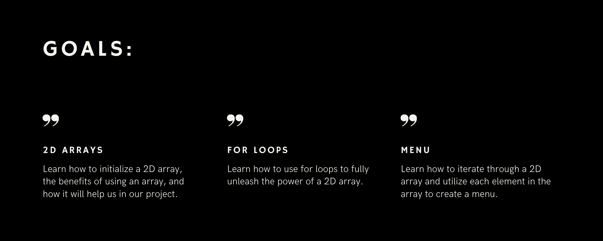

<link rel="stylesheet" href="../style.css">

Now that all of our restaurants are neatly sorted in an array for our customer to view, we now need to give the customer access to the menu items of each restaurant! To accomplish this, we will venture into the world of multidimensional arrays. 

Topics

{}

