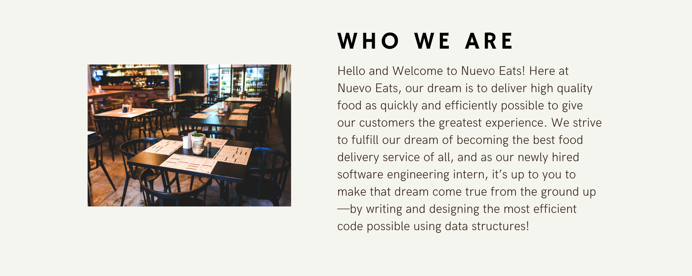

<link rel="stylesheet" href="../style.css">

<b><h2 style="font-size:3vw; font-family: sans-serif; font-weight: 600;">Transforming Lives, Through Food</h2></b>

The road ahead at NuevoEats will not be easy. That’s why we’re looking for people from all backgrounds to help us solve seemingly impossible problems at lightning speed. Those with courage and grit, who work hard, fast and smart. Those who don’t wait to implement good ideas, are comfortable with imperfection but determined to get 1% better every day. Think you’re up for the challenge? Join us!

Topics:

Topics

{}

