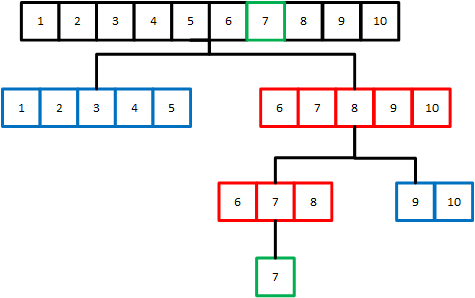

## Print Statements

Compiler errors are one thing, but runtime errors and bugs are another. While the compiler can easily tell you where to look, runtime bugs are caused by how your program executes. We need to understand what the program is doing when the bug happens: what variables are being used, which instruction is being executed, is there a missing statement we needed, etc. In smaller applications (like in school assignments), we can use print statements in the code to quickly figure out the program’s running state. Print statements are a quick and dirty way to look into a program as it’s running, and with luck you’ll be able to find what’s causing the bug without much infrastructure.

## Binary Search

One of the simpler algorithms you will learn or have learned is binary search, which lets you search for an item in a sorted list in logarithmic time. The idea is to check the middle of the sorted list and see if it matches the element we want; if we find the element, the algorithm is finished. If the element is higher, we search the upper half of the list. Otherwise, we search the lower half of the list. We repeat the process until we find the item we are searching for.



<iframe height="600px" width="100%" src="https://replit.com/@nuevofoundation/Debugging-Samples-C?lite=true#binary_search/binary_search.c" scrolling="no" frameborder="no" allowtransparency="true" allowfullscreen="true" sandbox="allow-forms allow-pointer-lock allow-popups allow-same-origin allow-scripts allow-modals"></iframe>

The following program will ask you to input a number to search an item in an array of 10000 elements! That's a lot.

But before running it lets check what the program is doing:
1. Lines 43-46 tell tell you what the program does and asks for your input.
2. Line 48-53 pre-populates the list of elements.
3. Line 55 calls the `binary_search()` function which takes three arguments: the array of elements, the array length, and the number we are searching for.
3. `binary_search` calls the recursive function, `rbin_search()`, which takes 4 arguments: the array of elements to search on, the index to start searching from, the index to stop searching on, and the element to search for.
4. `rbin_search()` performs the binary search in a recursive way and returns the element if it is found.

To compile the program, open the **Shell** lets change our directory to the `binary_search` folder:
```bash
cd binary_search
``` 
Once in the folder, lets compile our program and run it:
```bash
gcc binary_search.c -o binary_search
```

Great! No errors when compiling.

Now lets run our program:
```bash
./binary_search
```

When the program starts, on the prompt, input the number `5`, and click `Enter`. Great, the program works!

Now run the program again and search for the number `1`. The program stalls! 😮

{}
You can use `Ctrl + C` to terminate a running program on the command line. (`⌘ + C` on Mac)
{}

When faced with such a problem, you should ask yourself, what is the behavior of the bug? In this case, it is an infinite loop occurring somewhere in the code. This should quickly narrow down where you need to search for the bug, because, in the program, there's only one place an infinite loop **can** occur: the recursive `rbin_search()` function.

A `recursive function` breaks a problem into a bunch of smaller problems by calling itself and makes the problem easier to handle with a set of **base cases**. A recursive function that doesn't terminate usually has problems in one of the following:

1. The base cases are incomplete. 
2. The recursive calls are set in the wrong way.

Let's do some debugging!

Placing `print` statements across your code is a dirty but sometimes effective way to know if your code is working as intended. Go ahead and check if the `rbin_search()` is working as intended.

{} 
- Try placing print statement across the `rbinary_search` function to see how the `lo`, `hi` and `index` values are changing. This will tell us in which part of the array the code is searching on.
- Try searching something below `5`.
{}

What makes the problem we are trying to solve smaller? Is there a bug in how we handle that?
{}
Remember that binary search looks the relevant half of the array it needs to search on. We constantly compare the desired element with the middle element of the array we are searching on.
{}
<br/>

{} 
When the recursive call is being done after the if statement `(key > index)`, it is always checking the upper half of the array.
The conditional statement in line `24` should be a less than symbol (`<`) instead of a greater than symbol (`>`).
{}
<br/>

If you placed the print statements before the if statement `(key > query)` the program is infinitely looping, because the values of `hi` and `lo` stop changing and thus never fulfill the exit condition. This is a case where it was overlooked how the problem gets broken down. When we recursively call `rbin_search`, `hi` and `lo` have *inclusive* ranges, the problem doesn't get when searching on the upper part of the array.
<br/>

Print statements are not the best tool to use when the program complexity grows. They are extremely inefficient and if a programmer forgets to remove them, someone else (e.g. a user running your program) might see the print statements. In addition, if you’re using a lot of print statements it will negatively affect performance. In summary, only use print statements in isolated sections of your code and **ALWAYS** remember to remove them 🙂.

<!-- 
## Assertions

An alternative is assertions. Assertions are conditional statements that a programmer can declare. If the condition evaluates to false, the program will crash. Otherwise, the program will continue as if the assertion statement didn’t exist.

The nice thing about assertions is that they’re silent and can be turned off at the compiler level. They also lead you directly to where the code is faulty. Let’s use assertions to fix up a different implementation of binary search. This time, the algorithm uses an iterative approach rather than a recursive approach. Compile and run the program below using `make todo`

# TODO

<iframe></iframe>


When you run it, the program runs into a segmentation fault, which means that it tried to access some memory that it wasn’t allowed to. (For a more detailed explanation, see the aside).

We need to find where the program is trying to access this illegal memory. We can try to ensure that the program stays within bounds by writing an assertion, i.e. we never look outside the memory bound we expect.

(Work)

Aha! It seems that the assertion has caught something. The program is trying to dereference a `NULL` pointer, which should never happen. The fix is simple - we need to add an `if`-statement to make sure that the pointer is not `NULL`. -->
