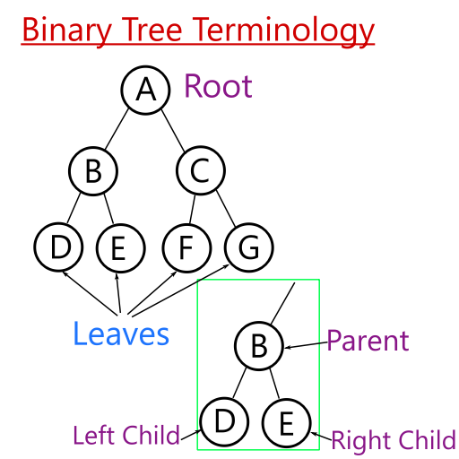
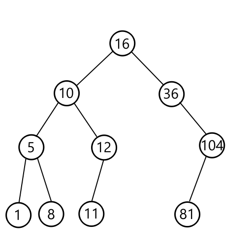
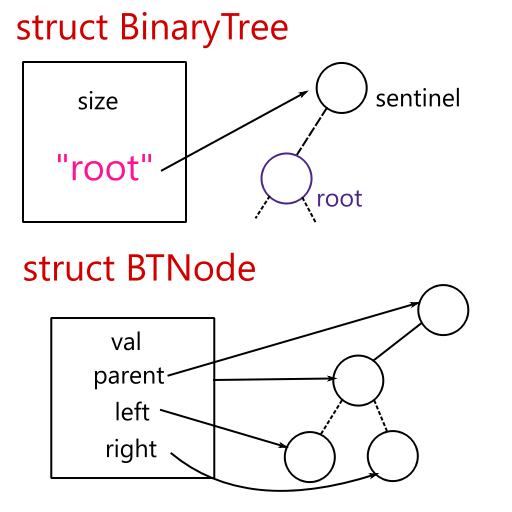

# Binary Tree

The binary tree is one of the simplest data structures in computer science and the ideas it uses are very useful. It stores sortable data and boasts an optimal runtime of O(log n) for searching, adding, and removing elements. However, this performance depends heavily on the order in which elements are added or removed, which limits its use to academic discussion.

## How it works

A binary tree consists of many nodes that are linked together. Each node has a parent nodes, or its predecessor, and up to two children nodes. A node that has no children is called a leaf. 

In a *rooted* binary tree, one node is specified as a root, meaning it has no parent. In the diagram below, node A is the parent of nodes B and C. X is the root, and B and C are leaves.

 

An important concept to think about is the binary tree’s recursive nature. We can think of each node as its own tree. Its children are in fact subtrees, so we don’t have to think about the structure of the tree as a whole, only the subtree that we are currently interested in.

We can use a binary tree to store information about a list's ordering. Each node can store one value, and its children must be ordered as follows:
- The left child must have smaller value than its parent.
- The right child must have a larger value than its parent.
- It is up to the programmer to decide how duplicate values are handled. The left child can store duplicates, or the right child can. As long as the direction is consistent across all nodes, there shouldn't be a problem.

{}
For this exercise we will ignore duplicate values for simplicity.
{}

The following diagram shows an example binary tree. Notice that the left children are all smaller than its parent, while the right children are larger.

 

To add an element, we need to find where it fits in the tree. To do this, we will perform a **tree traversal**. The idea is to move from node to node until we find a "spot" for the element we want to add. First, we start at the root. We then compare the value at the root with the element to add. If the element is larger, move to the right child. Otherwise, move to the left.

We can repeat this process again, until we find a node that can be the new element's parent. The diagram below illustrates adding 7 to a binary tree.

To remove an element, it’s a bit more tricky. We first need to find the element that we are removing. However, once we remove it we’ll need to fill in the “hole” that we’ve made in the tree. We can’t just fill in the hole with any plain element; we need to maintain the binary tree ordering property. A convenient element to take is the deepest, leftmost element from the hole’s right subtree.

The diagram shows how to remove elements in several cases. 
- In the first case, the node has no children - we can safely remove it.
- In the second case, the node has 1 child on the left or the right. We can simply slide the child up to this node's former spot.
- The the third case, the node has 2 children. There are a few ways to go about this, but the way we'll use is to take the smallest element of the right subtree, which will preserve the binary tree property. We then move it into the hole. If the smallest element has a right child, we need to slide it up, as pictured on the far right.

## Implementation

At the Nuevo team, we've created an implementation for the binary tree. However, the programmer was sloppy and didn't check his work, so there are errors and bugs! For this exercise, you will fix those bugs and errors. **Your goal is to have all tests pass.**

* To debug the code, you can use the command `make debug`. This will regenerate the debug files needed in the `debug/` directory and run `gdb` for you.
* To use `valgrind`, you can run the command `make memcheck`. This will recompile your code and run `valgrind` with the appropriate arguments.
* To test the code, you can click on the green "run" button, or use the command `make test`.

Let's take a look at what the existing code is doing. First, the binary tree data structure is defined in the `binary_tree.h` file. It can be referenced as a type called `BinaryTree`. The data is stored within a type called a `BTNode`, which represents a binary tree node. 

The tree itself contains a *sentinel node*, which makes other tree operations easier to handle. To get the actual root of the tree, we need to reference the left child of the sentinel. Thus, the root's parent is the sentinel node, rather than `NULL`.

{}
Using a sentinel lets us not worry about operations that involve updating the parent. For instance, if we remove a node, we would need to update both the parent pointer's child node and the child node's parent pointer. With a sentinel, we wouldn't worry about the parent pointer being `NULL`.
{}

Each node is allocated on the heap using `malloc`, so you'll need to make sure that there are no memory leaks! Note that we won't be testing the memory leaks specifically, however. 

Tree operations are defined in `binary_tree.h` too. If you are unsure of what a tree operation does, make sure to read its description there. We'll also include some reference pictures below. 

{}
There are multiple correct ways to implement `treeRemove`. Our tests will not discriminate between different (correct) ways of implementing the behavior. As long as the binary tree property is satisfied, it should work.
{}

The implementation does not need to handle duplicates within the tree, nor does it need to implement any of the tree `print` functions. 

Good luck!

<iframe height="500px" width="100%" src="https://replit.com/@nuevofoundation/Debugging-Exercise-1#binary_tree.c" scrolling="no" frameborder="no" allowtransparency="true" allowfullscreen="true" sandbox="allow-forms allow-pointer-lock allow-popups allow-same-origin allow-scripts allow-modals"></iframe>

## Reference Diagrams
(Picture - create/deleteTree)

(Picture - find/findMin)

(Picture - add/remove)

(Picture - printing)