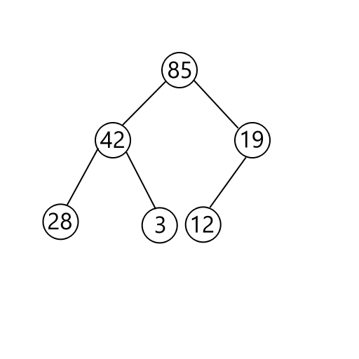

# Binary Heap

A binary heap is another data structure in computer science and is based off of the binary tree. However, a binary heap is a complete binary tree, which means that all nodes are filled out from left to right on a given level with no spaces in between.

On top of that, it has the heap ordering property: All nodes on a given level are either greater than the ones below (for a max heap), or less than the nodes below (for a min heap). We will be focusing on max heaps. Note that this is different from the binary tree, which requires left children to be smaller than the parent and right children to be larger.

Perhaps surprisingly, we can use an array to represent this data structure. A node i can be accessed by its index, i. To access its left child, multiply by 2. To access its right child, multiply by 2 and add 1.

There are two main operations to a binary heap: add and removeMax. The add operation adds an element to the array while maintaining the heap ordering property. Remove max removes the “top” of the heap.
To add an element, we first add it to the next available spot. Next, we retroactively “fix” any problems caused by this by repeatedly performing swaps until the element reaches a stable position in the heap:

(picture)

To perform removeMax, we first remove the top of the heap, which leaves a hole. To fill that hole, we take the last element and fill it in, and like before we retroactively “fix” any problems this causes. We repeatedly perform swaps downwards with the smaller child until it reaches a stable position in the heap.

(picture)

# The Implementation

We've written most of the code needed for the binary heap to work. However, there are a few nasty bugs that we haven't been able to fix. Luckily, the tests we've written *do* work. Your goal is to make sure that running `make test` passes all tests!

The implementation **will** be tested against duplicates, so make sure to handle those. Also, while the heap is fixed in size, the data is stored in the heap. Make sure that the data is free'd! 

Use any tools, like gdb, valgrind, etc. to your advantage. Good luck!

<iframe></iframe>