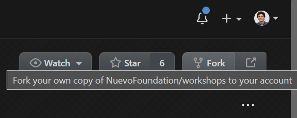

# Getting Started

#### Prerequisites
- [Visual Studio Code](https://code.visualstudio.com/download)
- [Hugo](https://gohugo.io/getting-started/installing/)
- [Git](https://git-scm.com/downloads) and you can get some experience here: https://try.github.io/

## Code

Contribution to this repository is via the [fork model](https://help.github.com/articles/fork-a-repo/). Contributors push changes to their own "forked" version of workshops, and then submit a pull request into it requesting those changes be merged.

To get started:

1. Fork the repo by clicking Fork in the top right corner:



2. From git bash, run (replacing _[user-name]_ with your GitHub user name):

```
\> git clone https://github.com/[user-name]/workshops.git
\> cd workshops
\workshops> git remote add upstream https://github.com/NuevoFoundation/workshops.git
\workshops> git remote set-url --push upstream no_push
```

The last command prevents an accidental push to this repository without going through a pull request.

After running above, `git remote -v` should show something similar to the following:
```
\project-system> git remote -v 
origin  https://github.com/dmonroym/workshops.git (fetch)
origin  https://github.com/dmonroym/workshops.git (push)
upstream        https://github.com/NuevoFoundation/workshops.git (fetch)
upstream        no_push (push)
```

## How to edit workshop content from GitHub

**Scenario**: Let's make a simple change to the Contributor Guidelines page and submit a pull request.

### Find the markdown page on the website
Open the [Workshop Contributor Guidelines](https://workshops.nuevofoundation.org/guidelines/) page, scroll to the bottom and click the "Edit on GitHub" hyperlink.

### Open the File editor 
Click the pencil icon on the page which should open [Edit File page](https://github.com/NuevoFoundation/workshops/edit/master/content/guidelines/_index.md). 

From here you can toggle between the `Edit file` tab to edit the content and the `Preview changes` tab for a rough preview of how the page would be rendereed. 

### Make a change 
From here, you can make a change to the page, say by adding two exclamation points to the word "Welcome!"

**Before**: `Welcome!`

**After**: `Welcome!!!`

### Commit the change 
At the bottom of the page, you will see the **Commit changes** section. Set the following values:

* **Title**: `Update index.md` Default, no change needed
* **Extended Description**: For our example, we will say: `this is a test PR, you can safely delete` 
* **Select**: `Create a new branch for this commit and start a pull request`

Finally, click the **Propose file change** button to create your pull request. 

### Review your pull request
Once created, go to the [Pull Requests](https://github.com/NuevoFoundation/workshops/pulls) tab to load your pull request.
