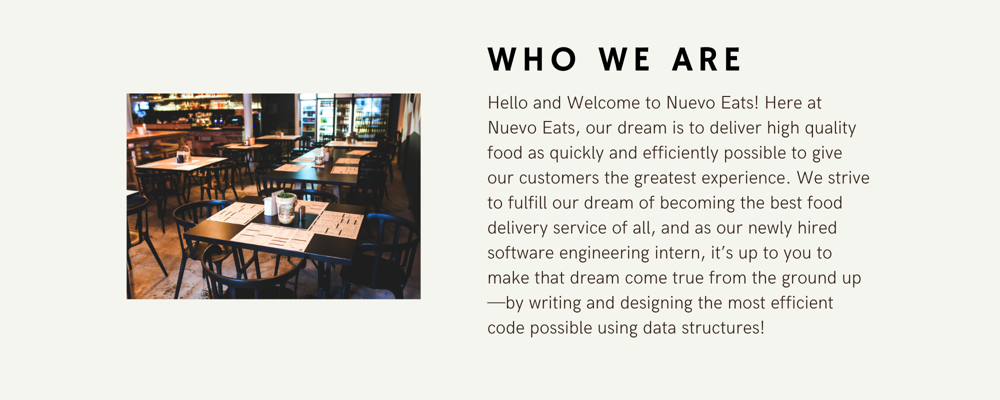

<iframe width="60%" height="600px" src="https://youtube.com/embed/UeK31RyFzN0" frameborder="0" allow="accelerometer; autoplay; clipboard-write; encrypted-media; gyroscope; picture-in-picture" allowfullscreen></iframe>

<!--<link rel="stylesheet" href="../../style.css">-->

## Transforming Lives, Through Food

At NuevoEats, our goal is to help empower and lift local economies and businesses. We start by helping merchants - the local businesses and restaurants that create 60%+ of the jobs in every city. Our dream is to build a last-mile logistics platform, create a set of services to grow a businesses' sales, and create a program that connects consumers to the businesses that sustain them.

The road ahead at NuevoEats will not be easy. That’s why we’re looking for people from all backgrounds to help us solve seemingly impossible problems at lightning speed. Those with courage and grit, who work hard, fast and smart. Those who don’t wait to implement good ideas, are comfortable with imperfection but determined to get 1% better every day. Think you’re up for the challenge? Join us!

Topics

{}

