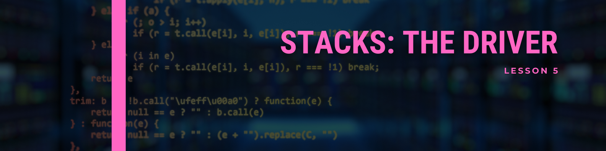
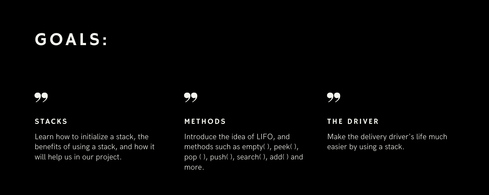

<!--<link rel="stylesheet" href="../../style.css">-->

A driver has to both pick up an order and deliver it to the customer. A driver may pick up multiple orders at the same time. For maximum efficiency, a driver wants to pick up the most amount of orders and make the most deliveries in the shortest path possible. If a driver is on the way to pick up an order from a restaurant, but suddenly a customer orders from a restaurant that is very close and on the way, to make the most out of his drive, a driver should be able to pick up the order from that restaurant. In general, a driver wants to pick up and deliver orders based on the shortest distance away. We can implement this behavior by utilizing a stack.

